T E C H N I C A L   O V E R V I E W
Secure Reliable Transport (SRT) Protocol
========================================

**NOTE**: This document was originally converted (2020-02-05) from the 
latest working version (2019-09-18) of the published draft:

https://github.com/Haivision/srt/files/2489142/SRT_Protocol_TechnicalOverview_DRAFT_2018-10-17.pdf

*Derived from the UDP-based Data Transfer protocol, SRT is a user-level
protocol that retains most of the core concepts and mechanisms while
introducing several refinements and enhancements, including control
packet modifications, improved flow control for handling live streaming,
enhanced congestion control, and a mechanism for encrypting packets.
This document describes the SRT protocol itself. A fully functional
reference implementation can be found at*
*https://github.com/Haivision/srt.*

## Introduction

SRT is a transport protocol that enables the secure, reliable transport
of data across unpredictable networks, such as the Internet. While any
data type can be transferred via SRT, it is particularly optimized for
audio/video streaming.

SRT can be applied to contribution and distribution endpoints as part of
a video stream workflow to deliver the best possible quality and lowest
latency video at all times.

As packets are streamed from a source to a destination device, SRT
detects and adapts to the real-time network conditions between the two
endpoints. SRT helps compensate for jitter and bandwidth fluctuations
due to congestion over noisy networks. Its error recovery mechanism
minimizes the packet loss typical of Internet connections. And SRT
supports AES encryption for end-to-end security.

SRT has its roots in the UDP-based Data Transfer (UDT) protocol. While
UDT was designed for high throughput file transmission over public
networks, it does not do well with live video. SRT is a significantly
modified version that supports live video streaming.

Low latency video transmission across IP based networks typically takes
the form of MPEG-TS unicast or multicast streams using the UDP protocol.
This solution is perfect for protected networks, where any packet loss
can be mitigated by enabling forward error correction (FEC). Achieving
the same low latency between sites in different cities, countries or
even continents is more challenging. While it is possible with satellite
links or dedicated MPLS networks, these are expensive solutions. The use
of cheaper public internet connectivity, while less expensive, imposes
significant bandwidth overhead to achieve the necessary level of packet
loss recovery.

Even though UDT was not designed for live streaming, its packet loss
recovery mechanism provided an interesting starting point. The original
version of SRT included new packet retransmission functionality that
reacted immediately to packet loss to enable live streaming.

To achieve low latency streaming, SRT had to address timing issues. The
characteristics of a stream from a source network are completely changed
by transmission over the public internet, which introduces delays,
jitter, and packet loss. This, in turn, leads to problems with decoding,
as the audio and video decoders do not receive packets at the expected
times. The use of large buffers helps, but latency is increased.

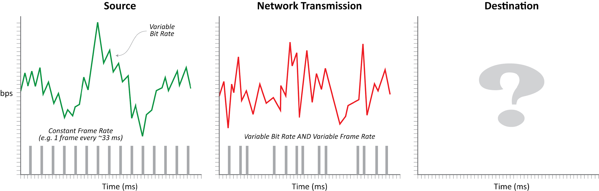

SRT includes a mechanism that recreates the signal characteristics on
the receiver side, dramatically reducing the need for buffering. This
functionality is part of the SRT protocol itself, so once data comes out
of an SRT connection on the receiver side, the stream characteristics
have been properly recovered.

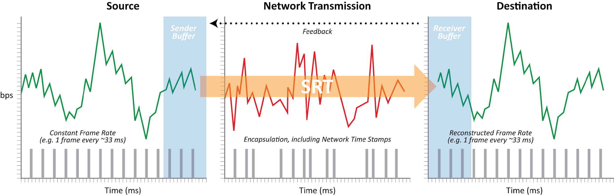

Initially developed by Haivision Systems Inc., the SRT protocol was
released as open source in April 2017 in partnership with Wowza Media
Systems Inc. Open source SRT is distributed under MPL-2.0, which was
chosen because it strikes a balance between driving adoption for open
source SRT, while encouraging contributions to improve upon it by the
community of adopters. Any third party is free to use the SRT source in
a larger work regardless of how that larger work is compiled. Should
they make source code changes, they would be obligated to make those
changes available to the community.

In May 2017, Haivision and Wowza founded the SRT Alliance
(www.srtalliance.org), a consortium dedicated to the continued
development and adoption of the protocol.

## Table of Contents

**[Introduction](#introduction) 1**

**[Table of Contents](#table-of-contents) 3**

**[Adaptation of UDT4 to SRT](#adaptation-of-udt4-to-srt) 6**

**[Packet Structure](#packet-structure) 8**

> [Data and Control Packets](#data-and-control-packets) 8
> 
> [Handshake Packets](#handshake-packets) 11
> 
> [KM Error Packets](#km-error-response-packets) 12
> 
> [ACK Packets](#ack-packets) 12
> 
> [Keep-alive Packets](#keep-alive-packets) 12
> 
> [NAK Control Packets](#nak-control-packets) 13
> 
> [SHUTDOWN Control Packets](#shutdown-control-packets) 13
> 
> [ACKACK Control Packets](#ackack-control-packets) 14
> 
> [Extended Control Message Packets](#extended-control-message-packets)
> 14

**[SRT Data Exchange](#srt-data-exchange) 15**

**[SRT Data Transmission and
Control](#srt-data-transmission-and-control) 16**

> [Buffers](#buffers) 16
> 
> [Send Buffer Management](#send-buffer-management) 16
> 
> [SRT Buffer Latency](#srt-buffer-latency) 17
> 
> [SRT Sockets, Send List & Channel](#srt-sockets-send-list-channel) 19
> 
> [Packet Acknowledgement (ACKs)](#packet-acknowledgement-acks) 20
> 
> [Packet Retransmission (NAKs)](#packet-retransmission-naks) 21
> 
> [Packet Acknowledgment in SRT](#packet-acknowledgment-in-srt) 22
> 
> [Bidirectional Transmission
> Queues](#bidirectional-transmission-queues) 24
> 
> [ACKs, ACKACKs & Round Trip Time](#acks-ackacks-round-trip-time) 25
> 
> [Drift Management](#drift-management) 26
> 
> [Loss List](#loss-list) 27

**[SRT Packet Pacing](#srt-packet-pacing) 29**

> [Packet Probes](#packet-probes) 34

**[The Sender‘s Algorithm](#the-senders-algorithm) 35**

**[The Receiver‘s Algorithm](#the-receivers-algorithm) 35**

**[Loss Information Compression
Scheme](#loss-information-compression-scheme) 35**

**[UDP Multiplexer](#udp-multiplexer) 35**

**[Timers](#timers) 35**

**[Flow Control](#flow-control) 35**

**[Configurable Congestion Control
(CCC)](#configurable-congestion-control-ccc) 36**

> [CCC Interface](#ccc-interface) 36
> 
> [Native Control Algorithm](#native-control-algorithm) 36

**[SRT Encryption](#srt-encryption) 37**

> [Overview](#overview) 37
> 
> [Definitions](#definitions) 41
> 
> [Encryption Process Walkthrough](#encryption-process-walkthrough) 44
> 
> [Messages](#messages) 48
> 
> [Parameters](#parameters) 52
> 
> [Security Issues](#security-issues) 53
> 
> [Implementation Notes](#implementation-notes) 54

**[SRT Handshake](#srt-handshake) 56**

> [Overview](#overview-1) 56
> 
> [Handshake Structure](#handshake-structure) 57
> 
> [The “Legacy” and “SRT Extended”
> Handshakes](#the-legacy-and-srt-extended-handshakes) 59
> 
> [The Caller-Listener Handshake](#the-caller-listener-handshake) 62
> 
> [The Rendezvous Handshake](#the-rendezvous-handshake) 64
> 
> [The SRT Extended Handshake](#the-srt-extended-handshake) 71
> 
> [SRT Extension Commands](#srt-extension-commands) 74
> 
> [SRT Congestion Control](#srt-congestion-control) 80
> 
> [Stream ID (SID)](#stream-id-sid) 80

**[Sample Implementation — HSv4 (Legacy) Caller/Listener Handshake with
SRT
Extensions](#sample-implementation-hsv4-legacy-callerlistener-handshake-with-srt-extensions)
81**

**[Terminology](#terminology) 85**

**[References](#references) 87**

> [SRT Alliance](#srt-alliance) 87
> 
> [SRT on GitHub](#srt-on-github) 87
> 
> [UDT](#udt) 87
> 
> [Encryption](#encryption) 88

##   

## **Adaptation of UDT4 to SRT**

UDT is an ARQ (Automatic Repeat reQuest) protocol. It implements the
third evolution of ARQ (Selective Repeat). The UDT version 4 (UDT4)
implementation was proposed as “informational” to the IETF but remained
a draft (draft-gg-udt-03), which expired on 2010-10-12\[1\].

UDT is aimed at the maximum use of capacity, so an application must
ensure input buffers are always available when it is time to send data.
When sending real-time video at a reasonable bit rate, the speed of
packet generation is slow compared to reading a file. Buffer depletion
causes some resets in the UDT transmission algorithm. Also, when
congestion occurred the sender algorithm could block the UDT API,
preferring to transmit the packets in the loss list, so that new video
frames could not be processed. Real-time video cannot be suspended, so
packets would be dropped by the application (since the transmission API
was being blocked). Unlike UDT, SRT shares the available bandwidth
between real-time and retransmitted packets, losing or dropping older
packets instead of newer.

The initial development of SRT involved a number of changes and
additions to UDT version 4, primarily:

  - > Statistics counters in bytes

  - > Buffer sizes in milliseconds to control Latency (measuring buffers
    > in time units is easier for configuring latency, and is
    > independent of stream bitrate)

  - > Statistics in ACK messages (receive rate and estimated link
    > capacity)

  - > Control packet timestamps (this is in the UDT draft but not in the
    > UDT4 implementation)

  - > Timestamp drift correction algorithm

  - > Periodic NAK reports (UDT4 disabled this draft feature in favor of
    > timeout retransmission of unACKed packets, which consumes too much
    > bandwidth for real-time streaming applications).

  - > Timestamp-Based Packet Delivery (configured latency)

  - > SRT handshake based on UDT user-defined control packet for
    > exchanging peer configuration and implementation information to
    > ensure seamless upgrades while evolving the protocol, and to
    > maintain backward compatibility

  - > Maximum output rate based on configured value or measured input
    > rate

  - > Encryption:
    
      - > Keying material generation from a passphrase
    
      - > Exchange of keying material and decryption status using a UDT
        > user-defined control packet (sender knows if a receiver can
        > properly decrypt stream)
    
      - > AES-CTR encryption/decryption: reassign 2 bits in the data
        > header‘s message number to specify the key (odd/even/none)
        > used for encryption; similar to the DVB scrambling control
        > field
    
      - > Ensure smooth key regeneration after CTR exhaustion

Early development of SRT was conducted using hardware encoders and
decoders (Makito X series from Haivision) on internal networks, where
randomly distributed packet drops were simulated using the *netem*
utility\[2\].

In the presence of moderate packet loss the decoder experienced buffer
depletion (no packets to decode). Lost packets were not retransmitted in
time. The fix for that was to trigger the unacknowledged packet
retransmission (the Auto Repeat of ARQ) earlier. However, this caused a
surge in bandwidth usage. Retransmission upon timeout is done when
packets are not acknowledged quickly enough. In UDT4, this
retransmission occurs only when the loss list is empty.

Retransmitting all the packets for which an ACK was past due (sent more
than RTT ms ago) resolved the test scenario since there was no
congestion and the random packet drop would affect different packets.
After many retransmissions, all packets would be delivered and the
receiver‘s queue unblocked. This was at the cost of huge bandwidth usage
since at the time there was no sending rate control.

##   

## Packet Structure

SRT maintains UDT‘s UDP packet structure, but with some modifications.
Refer to Section 2 of the UDT IETF Internet Draft (draft-gg-udt-03.txt)
for more details.

### Data and Control Packets

Every UDP packet carrying SRT traffic contains an SRT header
(immediately after the UDP header). In all versions, the SRT header
contains four major 32-bit fields:

  - > PH\_SEQNO

  - > PH\_MSGNO

  - > PH\_TIMESTAMP

  - > PH\_ID

SRT has two kinds of packets, where the first bit in the PH\_SEQNO field
in the packet header distinguishes between data (0) and control (1)
packets. Below, for example, is a representation of an SRT **data**
packet header (where the “packet type” bit = 0):

**NOTE**: *Changes in the packet structure were introduced in SRT
version 1.3.0. For the purpose of promoting compatibility with earlier
versions, old and new packet structures are presented here. Packet
diagrams in this document are in network bit order (big-endian).*

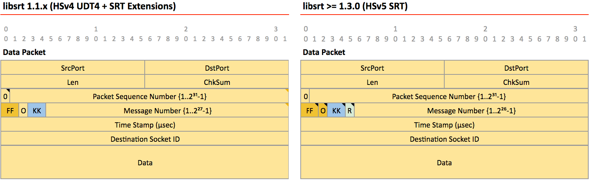

L E G E N D

Yellow = *UDT4 Draft 03*
Blue = *SRT 1.1 changes*
Green = *SRT 1.2 changes*
Purple = *SRT 1.3 changes*

  - > **FF** = (2 bits) Position of packet in message, where:
    
      - > 10b = 1st
    
      - > 00b = middle
    
      - > 01b = last
    
      - > 11b = single

  - > **O** = (1 bit) Indicates whether the message should be delivered
    > in order (1) or not (0). In File/Message mode (original UDT with
    > UDT\_DGRAM) when this bit is clear then a message that is sent
    > later (but reassembled before an earlier message which may be
    > incomplete due to packet loss) is allowed to be delivered
    > immediately, without waiting for the earlier message to be
    > completed. This is not used in Live mode because there‘s a
    > completely different function used for data extraction when TSBPD
    > mode is on.

  - > **KK** = (2 bits) Indicates whether or not data is encrypted:
    
      - > 00b: not encrypted
    
      - > 01b: encrypted with even key
    
      - > 10b: encrypted with odd key

  - > **R** = (1 bit) Retransmitted packet. This flag is clear (0) when
    > a packet is transmitted the very first time, and is set (1) if the
    > packet is retransmitted.

In Data packets, the third and fourth fields are interpreted as follows:

  - > TIMESTAMP: Usually the time when a packet was sent, although the
    > real interpretation may vary depending on the type.

  - > ID: The Destination Socket ID to which a packet should be
    > dispatched, although it may have the special value 0 when the
    > packet is a connection request

Additional details for Data packets are discussed later in this
document.

An SRT **control** packet header (“packet type” bit = 1) has the
following structure (UDP header not shown):

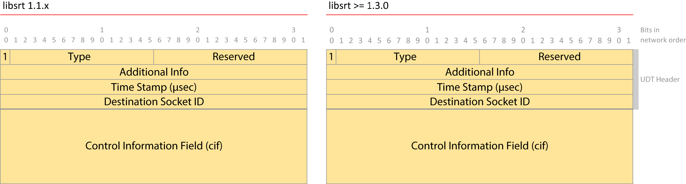

For Control packets the first two fields are interpreted respectively
(using network bit order) as:

  - > Word 0:
    
      - > Bit 0: packet type (set to 1 for control packet)
    
      - > Bits 1-15: Message Type
    
      - > Bits 16-31: Message Extended type

| **Type** | **Extended Type** | **Description**                                 |
| -------- | ----------------- | ----------------------------------------------- |
| 0        | 0                 | HANDSHAKE                                       |
| 1        | 0                 | KEEPALIVE                                       |
| 2        | 0                 | ACK                                             |
| 3        | 0                 | NAK (Loss Report)                               |
| 4        | 0                 | Congestion Warning                              |
| 5        | 0                 | Shutdown                                        |
| 6        | 0                 | ACKACK                                          |
| 7        | 0                 | Drop Request                                    |
| 8        | 0                 | Peer Error                                      |
| 0x7FFF   | \-                | Message Extension: defined by Reserved field    |
| 0x7FFF   | 1                 | SRT\_HSREQ: SRT Handshake Request               |
| 0x7FFF   | 2                 | SRT\_HSRSP: SRT Handshake Response              |
| 0x7FFF   | 3                 | SRT\_KMREQ: Encryption Keying Material Request  |
| 0x7FFF   | 4                 | SRT\_KMRSP: Encryption Keying Material Response |

The Extended Message mechanism is theoretically open for further
extensions. SRT uses some of them for its own purposes. This will be
referred to later in the section on the SRT Extended Handshake.

  - > Word 1:
    
      - > Additional info — used in some control messages as extra space
        > for data. Its interpretation depends on the particular message
        > type. Handshake messages don‘t use it.

##   

### Handshake Packets

Handshake control packets (“packet type” bit = 1) are used to establish
a connection between two peers in a point-to-point SRT session. Original
versions of SRT relied on handshake extensions to exchange certain
parameters immediately after a connection was opened, but as of version
1.3 an integrated mechanism ensures all parameters are exchanged as part
of the handshake itself. Refer to the **Handshake** section later in
this document for details.

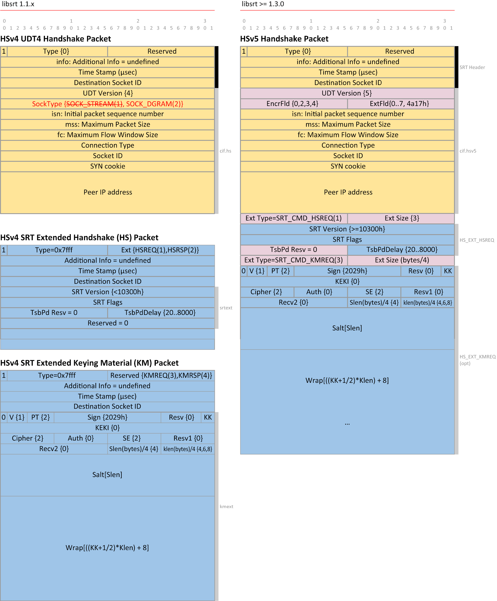

### KM Error Response Packets

Key Message Error Response control packets (“packet type” bit = 1) are
used to exchange error status messages between peers. Refer to the
**Encryption** section later in this document for details.

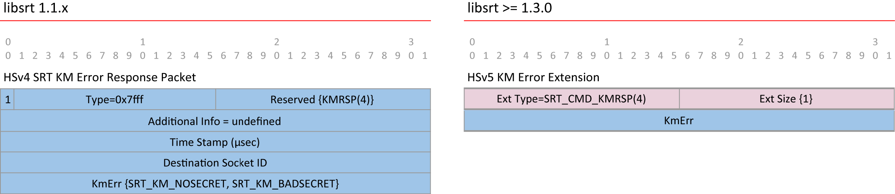

### ACK Packets

Acknowledgement (ACK) control packets (“packet type” bit = 1) are used
to provide data packet delivery status and RTT information. Refer to the
**SRT Data Transmission and Control** section later in this document for
details.

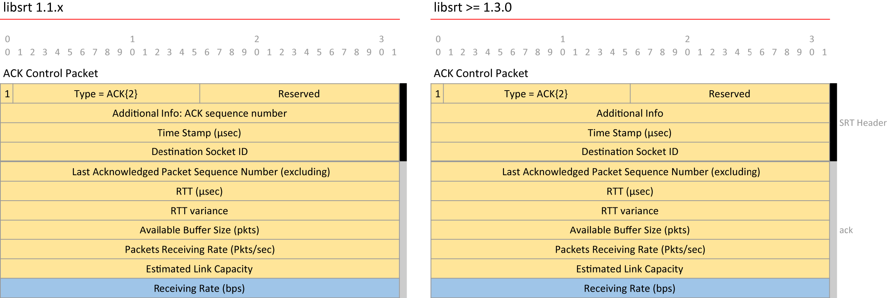

### Keep-alive Packets

Keep-alive control packets (“packet type” bit = 1) are exchanged
approximately every 10 ms to enable SRT streams to be automatically
restored after a connection loss.

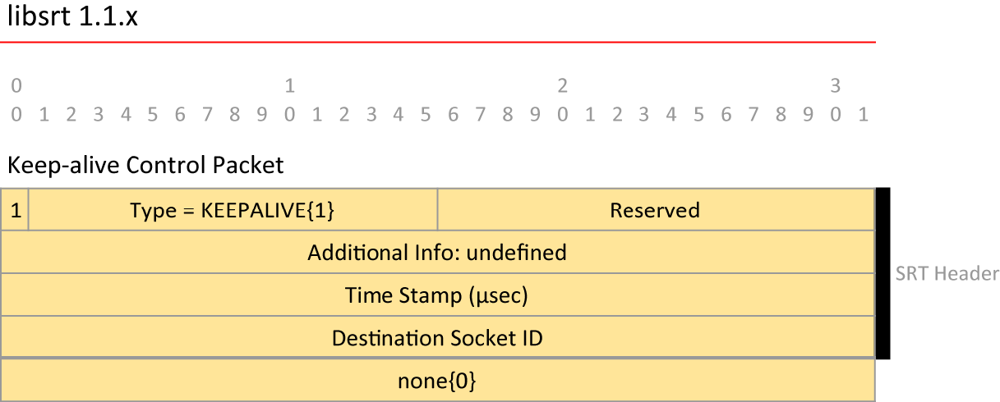

### NAK Control Packets

Negative acknowledgement (NAK) control packets (“packet type” bit = 1)
are used to signal failed data packet deliveries. Refer to the **SRT
Data Transmission and Control** section later in this document for
details.

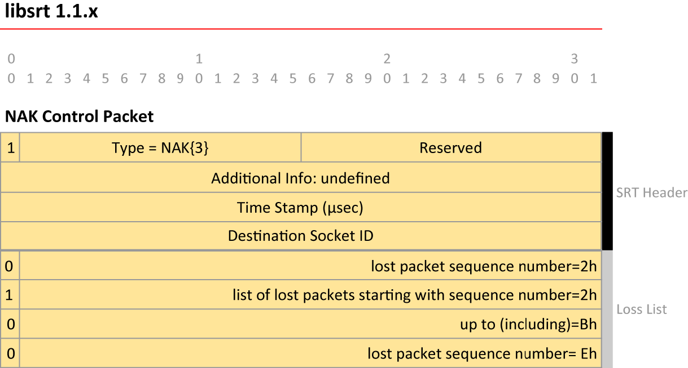

### SHUTDOWN Control Packets

Shutdown control packets (“packet type” bit = 1) are used to initiate
the closing of an SRT connection.

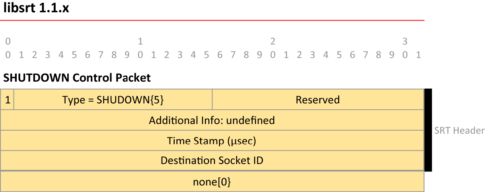

###   

### ACKACK Control Packets

ACKACK control packets (“packet type” bit = 1) are used to acknowledge
the reception of an ACK, and are instrumental in the ongoing calculation
of RTT. Refer to the **SRT Data Transmission and Control** section later
in this document for details.

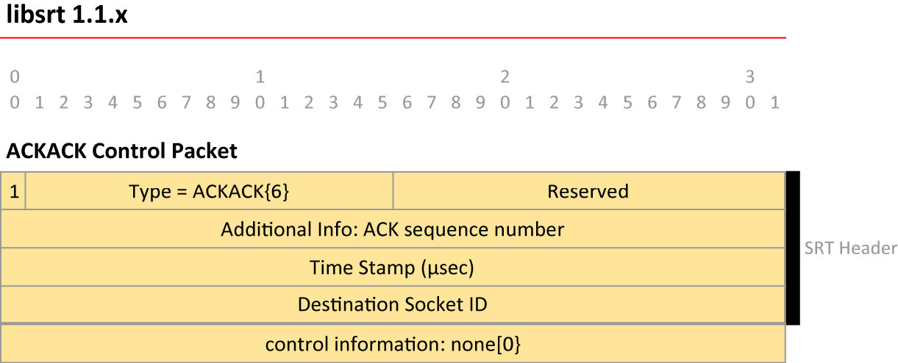

### Extended Control Message Packets

Extended Control Message packets (“packet type” bit = 1) are repurposed
from the original UDT User control packets. They are used in the SRT
extended handshake, either through separate messages, or inside the
handshake. Note that they are not intended to be used as user
extensions.

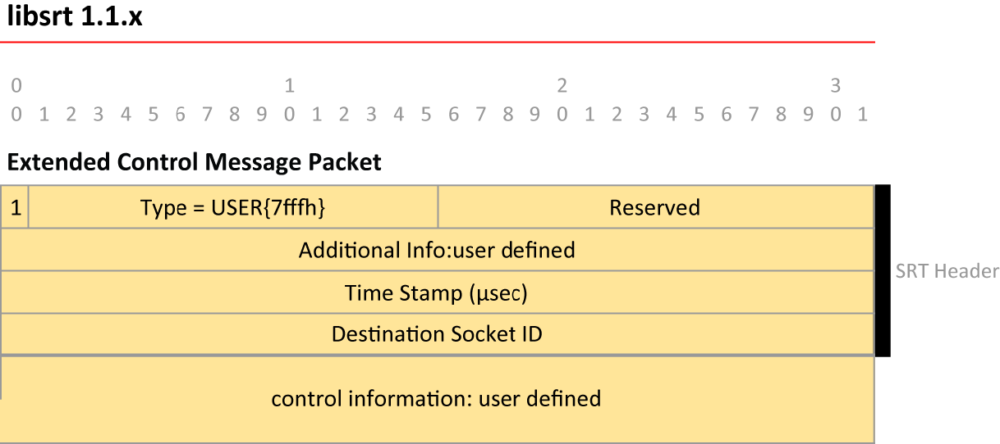

##   

## SRT Data Exchange

The diagram below provides a high level overview of the data exchange
(including control data) between two peers in a point-to-point SRT
session. Note that the roles of the peers change over the course of a
session. For example, the peers may start as Caller and Listener during
the handshake, but then become Sender and Receiver for the data
transmission portion.

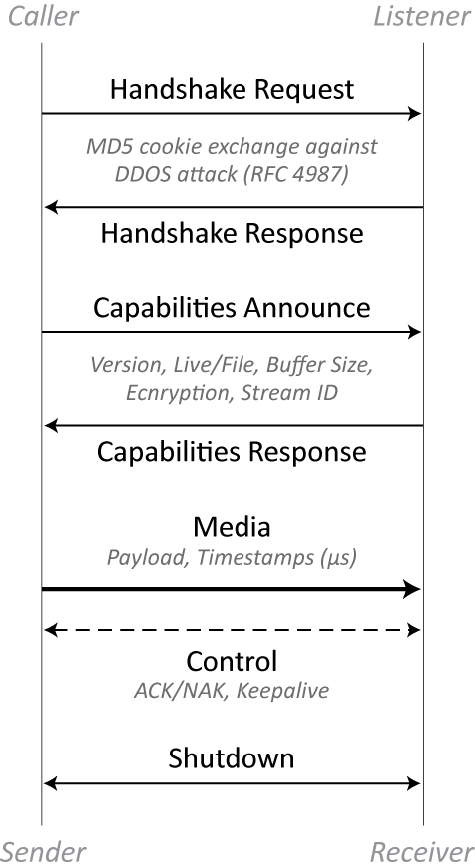

##   

## SRT Data Transmission and Control

This section describes key concepts related to the handling of control
and data packets during live streaming of audio and video.

### Buffers

When an application (such as an encoder) provides data packets to SRT
for transmission, they are stored in a circular send buffer. They are
all numbered with sequence IDs. Packets remain there until they are
acknowledged, in case they need to be retransmitted. Each has a
timestamp based on the connection time (determined during the handshake,
before the first packet is sent).

StartTime is when the application creates an SRT socket. A timestamp is
the time between StartTime and when a packet is added to the send
buffer.

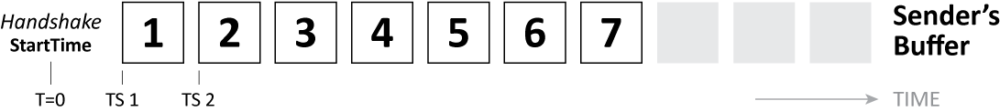

**NOTE**: *Time here is shown going from left to right, with the most
recent packet at the right.*

The receiver has a corresponding buffer. Packets are kept in that queue
just until the time that the oldest packet is delivered for output. When
the configured latency ends up aligned with packet 2, packet 1 is
delivered to the application.

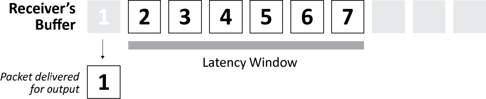

Timestamps are relative to the connection. The transmission is not based
on an absolute time. The scheduled execution time is based on a real
clock time. A time base is maintained to convert each packet‘s timestamp
to local clock time. Packets are offset from the sender‘s StartTime. Any
time reference based on local StartTime is maintained, taking into
account RTT, time zone and drift caused by the sum of truncated
nanoseconds and other measurements.

### Send Buffer Management

The send queue (SndQ) is a dynamically sized list that contains
references to the contents of the Sender's buffers. When a send buffer
has something to send, a reference is added to the SndQ. The SndQ is
common to multiple buffers sharing the same channel (UDP socket)\[3\].

The diagram below shows a send buffer associated with an SRT socket
(CUDT). The SndQ entry contains a reference to the socket, the
timestamp, and the location index, which is the location in the SndQ
itself. This reference object is part of the SndQ object.

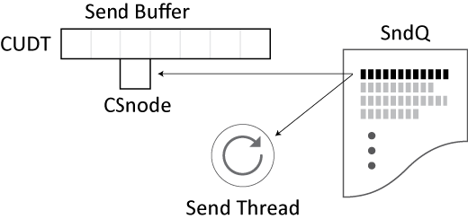

The SndQ is a double link list, where each entry points to the send node
(CSnode) of a send buffer. CSnode is an object of the SndQ class (SndQ
is a queue, but there are other members in the class). CSnode is not
related to the buffer contents. It has a pointer to its socket,
timestamp and a location (where it was inserted in the SndQ).

The SndQ has a send thread that looks to see if there is a packet to
send. Based on the data contained within the entries, it determines
which socket has the packet ready to be sent. It checks the timestamp
reference to see if the packet is indeed ready to send. If not, it
leaves it in the list. If it is ready, the thread removes it from the
list.

Every time the send thread sends a packet, it reinserts it in the list.
It then asks for the next packet in the send buffer. That packet‘s
timestamp determines where it will be reinserted in the SndQ, which is
sorted in order of timestamps.

Control packets are sent directly. They don‘t pass through the send
buffers or the SndQ. The SndQ updates variables for tracking where
packets are added (ACKPOS), and which was the last to be acknowledged
(LASTPOS).

### SRT Buffer Latency

The sender and receiver have large buffers that are defined in SRT code
(not exposed). On the sender, latency is the time that SRT holds a
packet to give it a chance to be delivered successfully while
maintaining the rate of the sender at the receiver. The effect of
latency is minimal on the sender, where it is used in the context of
dropping packets if an ACK is missing or late. It‘s much clearer on the
receiver side.

Latency is a value specified in milliseconds, which can cover hundreds
or even thousands of packets at high bitrate. Latency can be thought of
as a window that slides over time, during which a number of activities
take place.

For example, in the diagram below, packet \#2 is the oldest, and is at
the head of the receiver‘s queue (packet \#1 has already been
delivered).

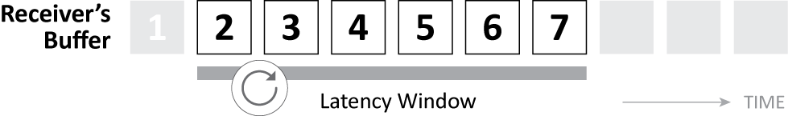

The latency “window” slides from left to right along the queue. When
packet \#2 slides out of that window, it is delivered to the application
on the receiver (e.g. decoder).

Consider a receiver buffer that is storing a series of packets. Let‘s
say we have defined the latency to cover a period equivalent to the
transmission of six packets. This latency can be thought of as a window
six packets long that slides as time advances.

The ability to recover packets within that latency window depends on the
time between transmissions. The latency window effectively defines what
is recoverable, or how many times a packet can be recovered, based on
the RTT.

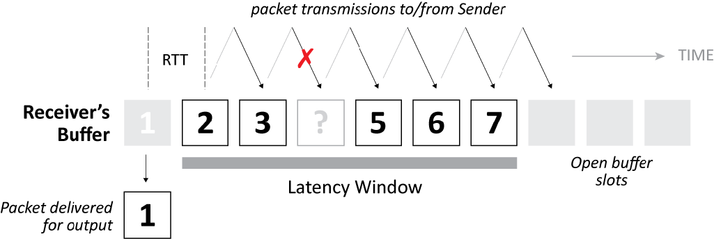

At the appropriate moment, the receiver‘s buffer releases the first
packet to the output application. When the latency window slides to
cover the next packet interval, the receiver‘s buffer releases the
second packet to the application, and so on.

Now let‘s see what happens when a packet is not received (packet \#4 in
this example). As the latency window slides, that packet is supposed to
be ready to give to the application, but is not available. That leads to
a skipped packet. It cannot be recovered, so it will be removed from the
loss list and never asked for again.

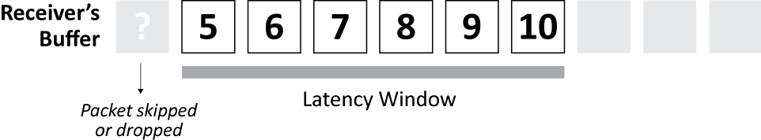

The sliding latency window can be thought of as a zone in which an SRT
receiver can recover (most) packets.

On the other side, the sender‘s buffer also has a latency window. As
time advances, the oldest packets that fall outside of the latency
window are no longer recoverable — even if they are sent, they will
arrive too late to be successfully processed by the receiver.

If the sliding latency window has moved past packets that have not yet
been delivered (receipt has not been ACKnowledged), it‘s too late to
send them. They would be outside the delivery window on the receiver —
even if they arrive at this point, they would be dropped. So these
packets can be removed from the send buffer.

It is important that both sender and receiver have the same latency
value to coordinate the timely arrival (or dropping) of packets. In
earlier versions of SRT, the sender would propose its latency to the
receiver in the handshake. If the latency configured on the receiver was
larger, it would put that value in a packet and send a response. As of
SRT 1.3.x both sides can be configured at once in the handshake (no
response step necessary).

A packet that falls out of the sender‘s latency window as it slides over
time is one that had already been sent but never acknowledged. It was in
the sender‘s buffer latency window, but the ACKPOS has not advanced (the
ACKPOS points to the next packet after the last one that has been
confirmed to have been received). When the latency window advances and
the oldest packet falls outside the window, it can then be removed. A
cleanup of the SndQ will artificially move the ACKPOS to the next packet
inside the latency window.

All of the packets in the send buffer have reserved positions, with a
configured length (7 cells of 188 plus overhead = 1316, plus a
header)\[4\]. There are actually many send buffers, each containing
contiguous packets in order. A send buffer is a circular queue, where
the beginning and end can be at any given points, but can never meet.
The protocol keeps the sequence (based on ACKs). During transmission the
sequence numbers in the packets can reach much higher levels than the
actual buffer locations. The sender‘s buffer works with positions. An
item in a buffer has a start position (STARTPOS). There is a conversion
between the position in the send buffer and the sequence number as the
two increase.

### SRT Sockets, Send List & Channel

Consider sockets 1 and 2, each with its own send buffer. The SndQ
contains a list of packets to send. There is a thread that continually
checks the send buffer. When a packet is ready to send, a CSnode is
created that identifies the packet‘s socket, and a corresponding object
is created in the SndQ that will point back to the send buffer.

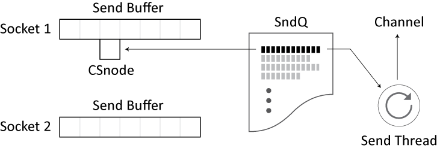

Each packet has a timestamp that dictates when to send it. The SndQ List
is sorted in order of the timestamps to be processed. If the send thread
determines that the socket 1 send buffer has a packet ready, then it
adds it to the SndQ queue. If the SndQ queue is empty, the packet entry
is placed at the beginning, with its timestamp, which determines when
the packet needs to be processed.

The other send buffer from socket 2 can also add to this SndQ. The send
thread will ask the buffer to give it a packet, and it will calculate
the spacing between the packets in terms of the rate.

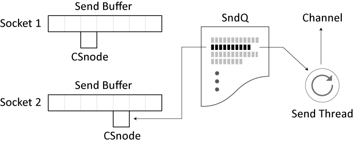

The timestamp together with the inter-packet interval will determine
where the packet will be re-inserted in the SndQ (either before or after
the packet from the socket 1 buffer).

The SndQ determines from which SRT socket send buffer to take the next
packet. The send buffers are tied to the sockets, while the SndQ is more
related to the channel. Several sockets can send to the same
destination, so they can be multiplexed.

When a packet is added to the socket, the SndQ is updated. And when a
packet is ready to be sent, it is re-inserted in the SndQ in the proper
position, based on its timestamp.

The processing happens in the SndQ. For each packet, there is a thread
that looks to see if it‘s time to send. If not, it does nothing.
Otherwise, it requests the SRT socket to give it the packet to send to
the channel. The entries in the SndQ are just references to the SRT
socket.

When a packet is written to the send buffer, it gets added to the SndQ,
which verifies with CSnode to make sure it does not make a duplicate
entry. It repeatedly removes entries and inserts new ones in the
appropriate places.

The timestamps for packets in different SRT sockets are local and are
defined as the time for sending compared to the current time. At the
moment that a packet is added to the SndQ, its timestamp is compared to
the current time to determine its position.

The operations of the send buffer and SndQ are decoupled. Packets are
added to the buffer, and then the SndQ is informed there is something to
send. Each has its own behavior.

The contents of the send buffer are added to the application thread (the
sender). Then there is another thread that interacts with the SndQ,
which is responsible for controlling the packet spacing with respect to
the input rate to the buffer. The output is adjusted by spacing the
packets in the buffer.

### Packet Acknowledgement (ACKs)

At certain intervals (see **ACKs, ACKACKs & Round Trip Time**), the
receiver sends an ACK that causes the acknowledged packets to be removed
from the sender‘s buffer, at which point the buffer space will be
recycled. An ACK contains the sequence number of the packet immediately
following the latest of the previous packets that have been received.
Where no packet loss has occurred this would be ACK(n+1).

For example, if the receiver sends an ACK for packet 6 (see below), this
means that all the packets with sequence numbers less than that have
been received, and can be removed from the sender‘s buffer.

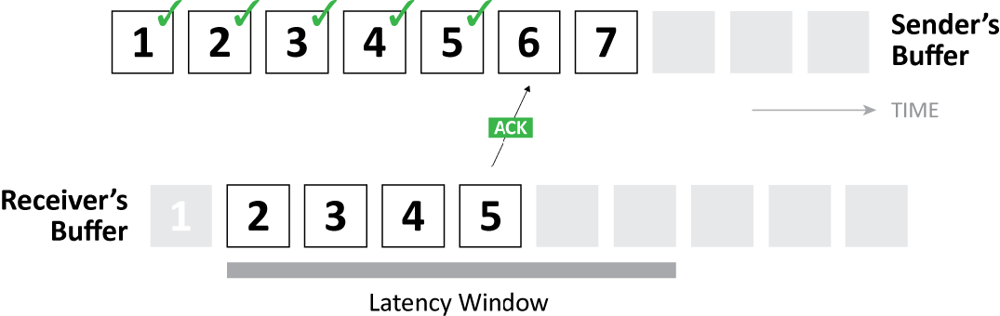

In the case of loss, the ACK(seq) is the sequence number of the first
packet in the loss list, which is the last contiguous received packet
plus 1.

### Packet Retransmission (NAKs)

If packet \#4 arrives in the receiver‘s buffer, but not packet \#3, a
NAK is sent to the sender. This NAK is added to a compressed list (the
periodic NAK report) that is sent at intervals to mitigate the
possibility that individual NAKs may themselves be delayed or lost in
transmission.

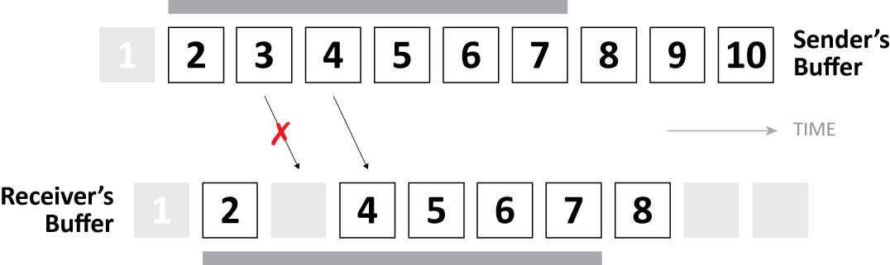

If packet number \#2 arrives, but packet \#3 does not, then when packet
\#4 arrives, the NAK is sent right away\[5\] to address the reordering.

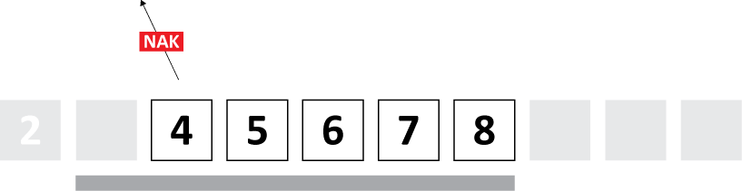

### Packet Acknowledgment in SRT

The UDT draft defines a periodic NAK control packet carrying a list of
all missing packets. The UDT4 implementation disabled this feature with
a comment in favor of retransmission upon timeout. A NAK is sent only
once for a missing packet when it is detected (i.e. when the following
packet is received). If this NAK is lost, the ACK will block at this
packet and prevent the delivery of more packets to the receiving
application until the loss list is cleared. On the sender side, the
missing packet would not be added to the loss list since the NAK was
never received, and NAKs for more recent packets lost after this one
prevented the retransmission of unACKed packets.

This implementation choice in UDT of dealing with congestion by blocking
retransmissions until the loss list is emptied is fundamentally wrong,
since retransmitting the loss list packets first would most probably not
unblock the receiver.

Subsequent modifications in SRT (e.g. Periodic NAK Reports,
Timestamp-based Packet Delivery, and Too-Late-Packet-Drop, etc.) reduced
the occurrences of ACK-timeout retransmissions.

**Timestamp-based Packet Delivery (TsbPD)**

This feature uses the timestamp of the UDT packet header. The initial
intent of the SRT TsbPD design was to reproduce the output of the
encoding engine at the input of the decoding engine. This design was
imagined in the absence of a transmission ceiling since the faster a
packet is transmitted, the faster missing packets will be retransmitted,
permitting a lower latency. But the SRT prototype was bandwidth hungry
in the presence of bad network conditions, and could hog the network
without limits.

Another problem with the original SRT TsbPd design is that it was
CPU-bound. The timestamps in the TS packets were based on the speed at
which a system could generate and stamp the packets. If the receiver did
not have the same CPU capacity, it could not reproduce the pattern of
the sender.

In current versions of SRT, TsbPD allows a receiver to deliver packets
to the decoder at the same pace they were provided to the SRT sender by
an encoder. Basically, the sender timestamp in the received packet is
adjusted to the receiver’s local time (compensating for time drift or
different time zone) before releasing the packet to the application.
Packets can be withheld by SRT for a configured receiver delay (mSec).
Higher delay can accommodate a larger uniform packet drop rate or larger
packet burst drop. Packets received after their “play time” are dropped.

The packet timestamp (in microseconds) is relative to the SRT connection
creation time. The original UDT code uses the packet sending time to
stamp the packet. This is inappropriate for the TsbPD feature since a
new time (current sending time) is used for retransmitted packets,
putting them out of order when inserted at their proper place in the
stream. Packets are inserted based on the sequence number in the header
field.

The origin time (in microseconds) of the packet is already sampled when
a packet is first submitted by the application to the SRT sender. The
TsbPD feature uses this time to stamp the packet for first transmission
and any subsequent re-transmission. This timestamp\[6\] and the
configured latency control the recovery buffer size and the instant that
packets are delivered at the destination.

The UDT protocol does not uses the packet timestamp, so this change has
no impact on that protocol or its existing congestion control methods.

**Fast Retransmit**

The UDT4 native retransmission of unacknowledged packets on timeout does
not work well for real-time data. Unacknowledged data is not
retransmitted as long as there are packets in the loss list. With
uniform distribution of packet loss, there is often something in the
loss list when the retransmission timer expires, starting a cascade of
events disrupting the flow of real time data (congestion window, sender
buffer full, packet dropped, etc.).

The Fast Retransmit feature addresses the issue by retransmitting
unacknowledged packets before the congestion window is full. The sender
adds to the loss list any packets that have not been ACKed within a
reasonable time, based on the RTT and the original timestamp of the
dropped packet.

Fast Retransmit reduces the receiver buffer size, and therefore latency.
It also makes any loss packet counter variations smoother compared to
re-retransmission when the congestion window is full. It is, however,
very bandwidth hungry. This SRT sender feature is kept for
interoperability with SRT 1.0 receivers. When the *Periodic NAK Reports*
feature is active, it rarely triggers and is kept as a watchdog.

**Periodic NAK Reports**

SRT 1.0 was not efficient at recovering packet loss above 2%. Many
packets were being retransmitted by the sender, often more than once,
without knowing if these packets were really lost. There are conditions
where the maximum overhead bandwidth and latency could not sustain the
loss rate.

Periodic NAK Reports are disabled in the UDT4 native code. The feature
was revived in the SRT 1.1.0 receiver, improving the functionality of
SRT in high loss environments, and the performance in all loss
conditions. The implementation requires about twice the loss rate for
retransmission bandwidth overhead. Recovery of up to 10% packet loss
within the limits of SRT configuration parameters can be achieved.

SRT Periodic NAK reports are sent with a period of RTT/2, with a 20 msec
floor (the UDT4 setting was 300 msec). A NAK control packet contains a
compressed list of the lost packets. Therefore, only lost packets are
retransmitted. By using RTT/2 for the NAK reports period, it may happen
that lost packets are retransmitted more than once, but it helps
maintain low latency in the case where NAK packets are lost.

**Too-Late-Packet-Drop**

This feature, introduced with SRT 1.0.5, allows the sender to drop
packets that have no chance to be delivered in time. In the SRT sender,
when Too-Late Packet Drop is enabled, and a packet timestamp is older
than 125% of the SRT latency, it is considered too late to be delivered
and may be dropped by the encoder. Packets of an IFrame tail can then be
dropped before being delivered.

Recent receivers (SRT \>= 1.1.0) will prevent buggy senders (\<= 1.0.7)
from enabling packet drop on the sender side. Recent senders (SRT \>=
1.1.0) keep packets at least 1000 ms if SRT latency is lower than 1000
msec (not enough for large RTT).

In the receiver, tail packets of a big I-Frame may be quite late and not
held by the SRT receive buffer. They pass through to the application.
The receiver buffer depletes and there is no time left for
retransmission if missing packets are discovered. Missing packets are
then skipped by the receiver.

### Bidirectional Transmission Queues

SRT also anticipates the case where the receiver has its own
transmission queue, and the sender has a corresponding receiver queue
for bidirectional communication.

It’s useful to think of this as a standard point-to-point SRT session
between Sender and Receiver, where each peer has a transmit/send (Tx)
buffer as well as a receive (Rx) buffer. The Sender’s Tx communicates
with the Receiver’s Rx, while the Receiver’s Tx communicates with the
Sender’s Rx. Just as in a regular one-way session, the Tx/Rx latency
values must match.

In the handshake packet, the sender will provide both its preferred Tx
latency and a suggested “peer latency” (the value for the Receiver’s
Tx). The Receiver responds with corresponding values. The proposed
latency values are evaluated on both sides (and the larger values
chosen) within a single RTT period.

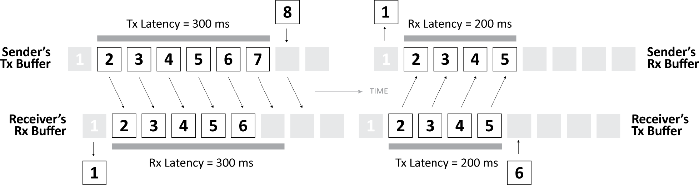

###   

### ACKs, ACKACKs & Round Trip Time

Round-trip time (RTT) is a measure of the time it would take for a
packet to travel back and forth. SRT cannot measure one-way transmission
time directly, so it uses RTT/2, which is calculated based on an ACK. An
ACK (from a receiver) will trigger the transmission of an ACKACK (by the
sender), with almost no delay. The time it takes for an ACK to be sent
and an ACKACK to be received is the RTT.

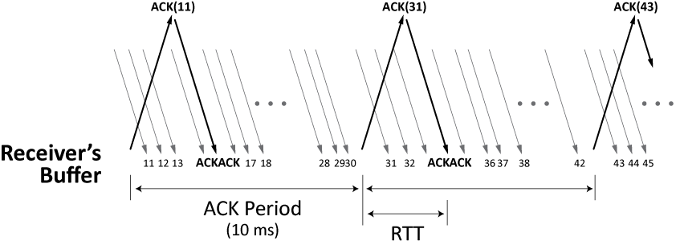

The ACKACK tells the receiver to stop sending the ACK position because
the sender already knows it. Otherwise, ACKs (with outdated information)
would continue to be sent regularly. Similarly, if the sender doesn‘t
receive an ACK, it doesn‘t stop transmitting.

There are two conditions\[7\] for sending an acknowledgement. A full ACK
is based on a timer of 10 ms (the ACK period). For high bit rate
transmissions, a “light ACK\[8\]” can be sent, which is an ACK for a
sequence of packets. In a 10 ms interval, there are often so many
packets being sent and received that the ACK position on the sender
doesn‘t advance quickly enough. To mitigate this, after 64 packets (even
if the ACK period has not fully elapsed) the receiver sends a light ACK.

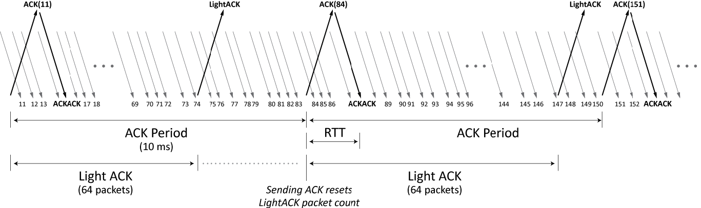

An ACK serves as a ping, with a corresponding ACKACK pong, to measure
RTT. Each ACK has a number. A corresponding ACKACK has that same number.
The receiver keeps a list of all ACKs in a queue to match them. Unlike a
full ACK, which contains the current RTT and several other values in the
control information field (CIF), a light ACK just contains the sequence
number (see diagrams below). All control messages are sent directly and
processed upon reception, but ACKACK processing time is negligible (the
time this takes is included in the round-trip time).

The RTT is calculated by the receiver and sent with the next full ACK.
Note that the first ACK in an SRT session might contain an initial RTT
value of 100 ms, because the early calculations may not be precise.

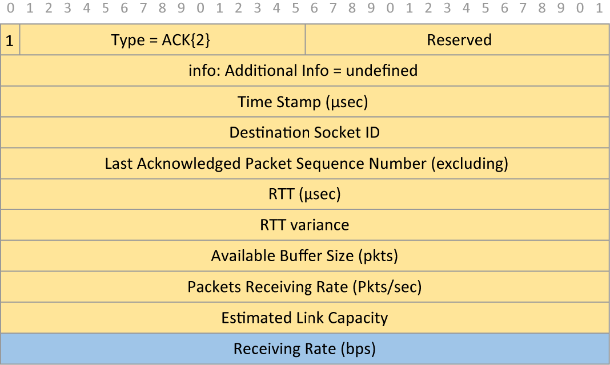

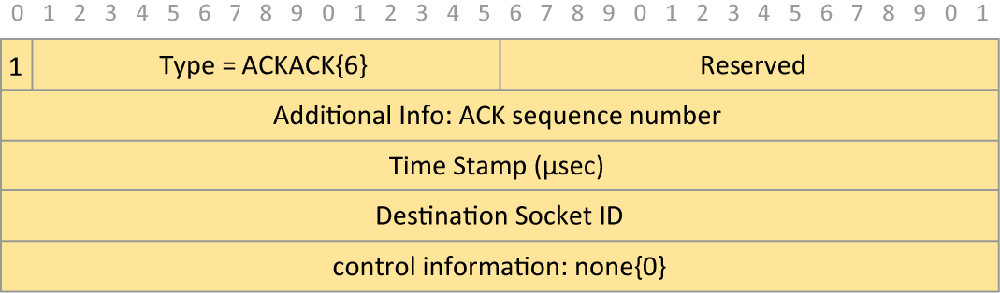

The sender always gets the RTT from the receiver. It does not have an
analog to the ACK/ACKACK mechanism (i.e. it can‘t send a message that
guarantees an immediate return without processing).

### Drift Management

When the sender enters “connected” status it tells the application there
is a socket interface that is transmitter-ready. At this point the
application can start sending data packets. It adds packets to the SRT
sender‘s buffer at a certain input rate, from which they are transmitted
to the receiver at scheduled times.

A synchronized time is required to keep proper sender/receiver buffer
levels, taking into account the time zone and round-trip time (up to 2
seconds for satellite links). Considering addition/subtraction
round-­off, and possibly unsynchronized system times, an agreed-­upon
time base drifts by a few microseconds every minute. The drift may
accumulate over many days to a point where the sender or receiver
buffers will overflow or deplete, seriously affecting the quality of the
video. SRT has a time management mechanism to compensate for this drift.

When a packet is received, SRT determines the difference between the
time it was expected and its timestamp. The timestamp is calculated on
the receiver side. The RTT tells the receiver how much time it was
supposed to take. SRT maintains a reference between the time at the
leading edge of the send buffer‘s latency window and the corresponding
time on the receiver (the present time). This allows conversion to real
time to be able to schedule events, based on a local time reference.

The receiver samples time drift data\[9\] and periodically calculates a
packet timestamp correction factor, which is applied to each data packet
received by adjusting the inter-packet interval. When a packet is
received it isn‘t given right away to the application. As time advances,
the receiver knows the expected time for any missing or dropped packet,
and can use this information to fill any “holes” in the receive queue
with another packet.

The receiver uses local time to be able to schedule events — to
determine, for example, if it‘s time to deliver a certain packet right
away. The timestamps in the packets themselves are just references to
the beginning of the session. When a packet is received (with a
timestamp from the sender), the receiver makes a reference to the
beginning of the session to recalculate its timestamp. The start time is
derived from the local time at the moment that the session is connected.
A packet timestamp equals “now” minus “StartTime”, where the latter is
the point in time when the socket was created.

### Loss List

The sender maintains a list of lost packets (loss list) that is built
from NAK reports. When scheduling to transmit, it looks to see if a
packet in the loss list has priority, and will send it. Otherwise, it
will send the next packet in the SndQ list. Note that when a packet is
transmitted, it stays in the buffer in case it is not received.

NAK packets are processed to fill the loss list. As the latency window
advances and packets are dropped from the send queue, a check is
performed to see if any of the dropped or resent packets are in the loss
list, to determine if they can be removed from there as well so that
they are not retransmitted unnecessarily. The operations in the send
queue and the loss list are managed by changing the ACK position
(ACKPOS).

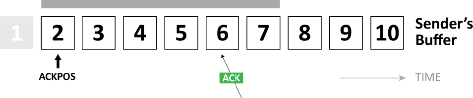

When the ACKPOS has advanced to a certain point, all the packets older
than the one at that position are removed from the send queue.

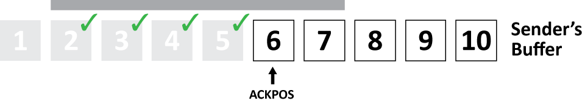

When a receiver encounters the situation where the next packet to be
played was not successfully received from the sender, it will “skip”
this packet and send a fake ACK. To the sender, this fake ACK is a real
ACK, and so it just behaves as if the packet had been received. This
facilitates the synchronization between sender and receiver. The fact
that a packet was skipped remains unknown by the sender. Skipped packets
are recorded in the statistics on the receiver.

What the sender sees is the NAKs that it has received. There is a
counter for the packets that are resent. If there is no ACK for a
packet, it will stay in the loss list and can be resent more than once.
Packets in the loss list are prioritized.

If packets in the loss list continue to block the send queue, at some
point this will cause the send queue to fill. When the send queue is
full, the sender will begin to drop packets without even sending them
the first time. An encoder (or other application) may continue to
provide packets, but there‘s no place for them, so they will end up
being thrown away. SRT is unaware of these “unsent packets”, and they
are not reported in the SRT statistics.

This condition where packets are unsent doesn‘t happen often. There is a
maximum number of packets held in the send buffer based on the
configured latency. Older packets that have no chance to be
retransmitted and played in time are dropped, making room for newer
real-time packets produced by the sending application. A minimum of one
second is applied before dropping the packet when low latency is
configured. This one-second limit derives from the behavior of MPEG
I-frames with SRT used as transport. I-frames are very large (typically
8 times larger than other packets), and consequently take more time to
transmit. They can be too large to keep in the latency window, and can
cause packets to be dropped from the queue. To prevent this, SRT imposes
a minimum of one second (or the latency value) before dropping a packet.
This allows for large I-frames when using small latency values.

##   

## SRT Packet Pacing

UDT uses a maximum bandwidth setting to control the packet output rate.
This static setting isn‘t well-suited to a variable input, like when you
change the bit rate on an encoder. SRT controls packet pacing based on
the input rate and an overhead for the retransmission (which is
calculated on the output).

Originally, SRT took as input the rate that had been configured as the
expected output rate of an encoder (in terms of bit rate for the packets
including audio and overhead). But it‘s normal for an encoder to
occasionally overshoot. At low bit rate, sometimes an encoder can be too
optimistic and will output more bits than expected. Under these
conditions, SRT packets would not go out fast enough because SRT ends up
being wrongly configured.

This was mitigated by calculating the bit rate internally. SRT examines
the packets being submitted and calculates the bit rate as a moving
average. However, this introduces a bit of a delay based on the content.
It also means that if an encoder encounters black screens or still
frames, this would dramatically lower the bit rate being measured, which
would in turn reduce the SRT output rate. And then, when the input from
the encoder picks up, SRT would not start up again fast enough on
output. Packets would be delayed and would arrive late at the decoder,
causing errors.

A proposed solution is to have SRT take the input rate configuration
from the encoder, measure the actual input, and use whichever value is
larger.

Output is controlled by calculating a packet period (the interval
between two packets). For a given bit rate, SRT calculates the average
size of a packet. The interval between the packets is determined by
comparing the timestamps between consecutive packets. Packet output is
scheduled based on the packet size and interval.

Transmission speed is controlled by a timer between the packets. In the
legacy code, the packet period is adjusted by the congestion control
module on the sender. Based on feedback from the network, it shrinks to
speed up or grows to slow down. But this does not work well for SRT in
live mode. The audio/video stream bitrate is embedded in the MPEG-TS
packets assembled by the streamer, and modifying the output packet pace
will not affect the expected elementary stream rate at the receiving
side — it will just break the decoding. What was done originally in SRT
was to apply a period such that the output rate resembles the input. By
default, SRT measures the bit rate of the input stream, and then it
adjusts the packet period accordingly.

SRT needs a certain amount of bandwidth overhead in order to have space
to insert retransmitted packets without affecting the SRT sender‘s main
stream output rate too much so that packets can be transmitted normally.
The only way to apply the network feedback to reduce congestion was to
control the encoder output bit rate (SRT input). It was not possible to
adjust the packets that had already been assembled with an expected
bitrate, because the expectation was that they would be output at that
rate for the decoder.

There are three configuration elements: INPUTBW, MAXBW, and OVERHEAD
(%).

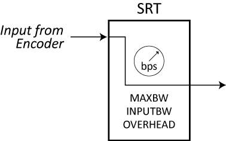

| **MAXBW** | **INPUTBW** | **OVERHEAD (%)** | **Output Rate**\[10\]            |
| --------- | ----------- | ---------------- | -------------------------------- |
| mbw       | n/a         | n/a              | \<mbw\>                          |
| 0         | 0           | oh               | \<smpinpbw\> \* (100+\<oh\>)/100 |
| 0         | ibw         | oh               | \<ibw\>\*(100+\<oh\>)/100        |

Setting the input bandwidth (INPUTBW) parameter to 0 engages internal
measurements (smpinpbw) to set the packet period, and to combine it with
the overhead setting to adjust the output.

Alternatively, an absolute maximum bandwidth (MAXBW) can be configured
to set a cap. Setting MAXBW to zero forces SRT to use only INPUTBW to
adjust the output.

There are certain considerations that an SRT integrator should take into
account. The problem with using the input bandwidth method (measuring
internally) is that there is a lag in the measurement because it is
based on a moving average. So if the input rate suddenly falls to zero
(for example, because there is a black screen in the video stream), the
measured drop results in a lowered output rate. But when the video picks
up again, the input rate rises sharply. The output rate from SRT lags
slightly behind the input rate from the encoder. Packets accumulate in
the SRT sender‘s buffer, because of the time it takes to measure the
speed. If they arrive too late at the output, there is a negative
effect.

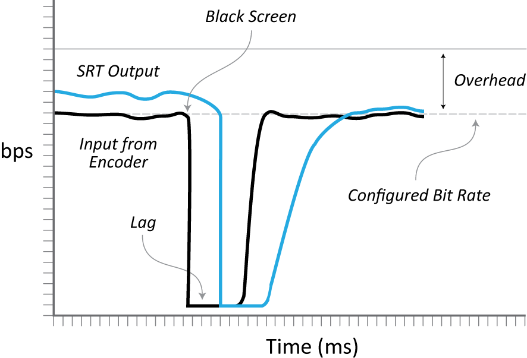

To correct this, the SRT sender‘s output can be configured at the
nominal bit rate of the input by interacting more directly with the
video encoder on which SRT is running. Since it is possible to know the
bit rate at which the encoder is configured, any modification can be
passed directly into the SRT configuration (INPUTBW). This is the goal.

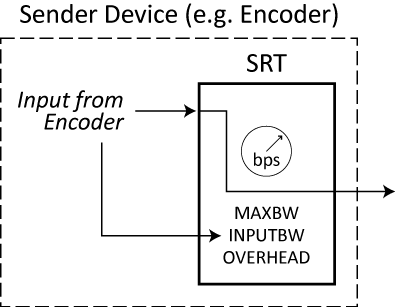

In the diagram below, the SRT sender‘s output starts to follow the dip
in encoder input caused by the black screen, but will not follow all the
way.

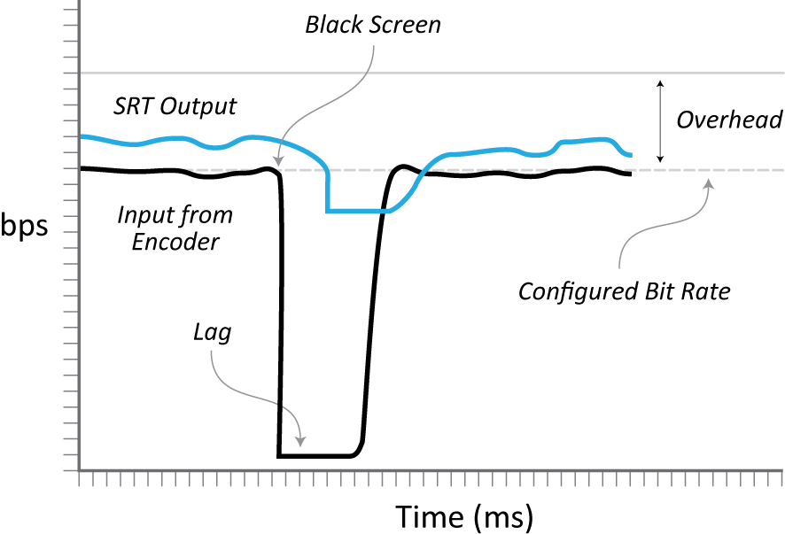

But this solution has its own weaknesses. At low bit rate, the input to
SRT from an encoder will often exceed the nominal bit rate. Since the
SRT sender‘s output is being adjusted based on the configured encoder
bitrate, input that is too high causes an accumulation of packets in the
send buffer. The buffer can fill up faster than packets are being sent
out. The SRT output would be at the right speed, but these accumulated
packets would have to be transmitted over an extended period of time.
They would accumulate in the buffer, wouldn‘t be output quickly enough,
and eventually some packets would be sent too late.

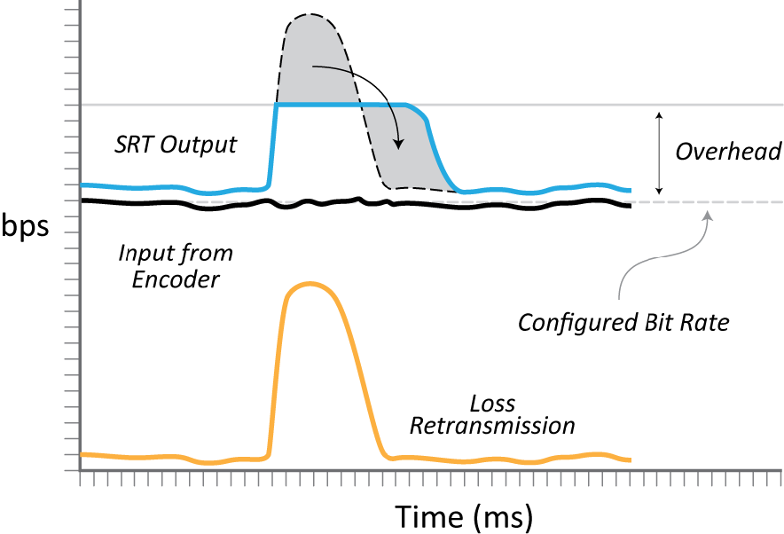

The orange line in graphs above represents packets that have to be
retransmitted using the available overhead space, based on the latency.
The area under the orange line represents the volume of packets that
were lost. These have to be added on top of the regular flow, the
real-time live stream, which has to be maintained at all times.

In principle, the space between packets determines where retransmissions
can be inserted, and the overhead represents the available margin. There
is an empiric calculation that defines the interval (in microseconds)
between two packets to give a certain bit rate. It‘s a function of the
payload (which includes video, audio etc.).

SRT tries to re-create the sender‘s input bandwidth on the decoder’s
output, such that the act of retransmitting packets is transparent, as
if they never had to be resent in the first place. This works up to a
point, but as soon as the packet pacing goes down, there‘s an
accumulation that happens in the send buffer. It becomes increasingly
full, and doesn‘t empty fast enough, until at some point packets start
dropping.

SRT version 1.3 combines the two packet pacing methods. The input is
measured, but if it falls too low, the nominal input bit rate value for
the SRT sender‘s output is respected. If a measurement is lower than the
nominal configuration, it isn‘t followed (if there are no packets to
send SRT doesn‘t send anything). However, if the encoder input rate
rises above the configured rate, it will be followed as much as
possible. Combining the two methods overcomes the deficiencies of each.

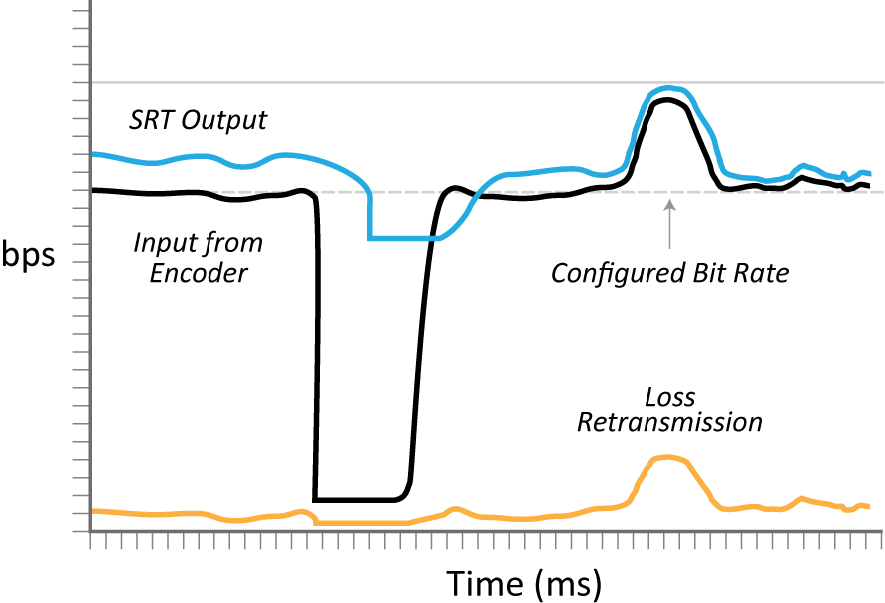

In theory, the bandwidth cap is accounted for by the bandwidth overhead.
If there are too many packets to retransmit, SRT does not transmit them.
But this mechanism of capping the bandwidth doesn‘t work too well. The
bandwidth limit is broken too easily.

Another change made in SRT version 1.3 was to add a configuration option
called OUTPACEMODE, which enables combinations of the other pacing
elements. Recall that MAXBW is the mode with an absolute cap that
doesn‘t follow the fluctuations in the encoder input. Each time the
input bit rate is configured on the encoder, MAXBW must also be
reconfigured. Setting MAXBW to zero means use INPUTBW. Conversely,
setting INPUTBW to zero means measure internally.

SRT version 1.3 uses a combination of techniques to take the configured
input, compare against the measured value, and use the maximum of the
two. OUTPACEMODE is used to enable combinations of these other
configuration elements. It specifies the use of MAXBW, or of INPUTBW, a
combination of the two, or neither (no limit)\[11\].

SRT packet pacing can be summarized as follows. By default, the output
rate of the live-mode SRT sender is tailored based on the input rate
(the output of a streamer). The input rate (sendmsg API) is measured
internally and the output pace is adjusted accordingly, including the
configured overhead (default = 25%) that is added to permit the
injection of retransmitted packets.

### Packet Probes

While SRT exercises a certain amount of control over packet flow, there
are limits imposed by the inability to precisely calculate the capacity
of the link. The technique that is used is to send “packet probes” every
16 packets with no inter-packet spacing\[12\]. At the receiver, the
packet spacing is measured to see if network traversal introduces
inter-packet delays. If there is a gap between the two packets when they
arrive at the receiver, this is an indication of cross traffic, which
would mean that the available network capacity is reduced. This helps to
measure the capacity of the link. But the calculation of the spacing
between packets is not controlled, so the available bandwidth remains
difficult to determine.

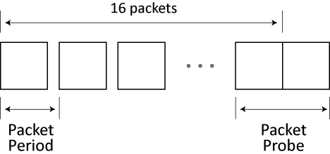

### 

###   

## The Sender‘s Algorithm

Refer to Section 6.1 of the UDT IETF Internet Draft
(draft-gg-udt-03.txt) for details.

## The Receiver‘s Algorithm

Refer to Section 6.2 of the UDT IETF Internet Draft
(draft-gg-udt-03.txt) for details.

## Loss Information Compression Scheme

Refer to Section 6.4 of the UDT IETF Internet Draft
(draft-gg-udt-03.txt) for details.

## UDP Multiplexer

SRT uses UDT‘s UDP multiplexer as is.

Refer to Section 3 of the UDT IETF Internet Draft (draft-gg-udt-03.txt)
for details.

## Timers

SRT uses UDT‘s timers, but with some changes. The NAK timer has a
minimum value that existed in the UDT4 code but is not described there.
For SRT, this minimum value depends on the congestion control type being
used.

Refer to Section 4 of the UDT IETF Internet Draft (draft-gg-udt-03.txt)
for details.

## Flow Control

Flow control, in terms of transfers, allows a stream to be a good
Internet citizen. Flow control in SRT‘s live mode is really the absence
of flow control. SRT does not take the TCP “slow down quickly, speed up
slowly” approach where, when you detect congestion, you slow down. This
does not work with real-time streaming. SRT tries to maintain the rate,
even during periods of congestion. This makes it worse because more
retransmissions are required, which can‘t be reduced by the SRT protocol
alone. It would have to be done outside of SRT with network adaptive
encoding, where the control would be at the input.

Refer to Section 6.3 of the UDT IETF Internet Draft
(draft-gg-udt-03.txt) for more details.

##   

## Configurable Congestion Control (CCC)

The UDT protocol features a congestion control mechanism that allows it
to be a good network citizen by holding back packets as network
congestion increases. This was an acceptable approach for file transfers
that are not time constrained. But in order to accommodate the needs of
live streaming, this UDT mechanism was modified in early versions of SRT
to minimize or eliminate packet delays. Later versions of SRT have
restored congestion control functionality to support the transmission of
either live streams or large files.

The UDT congestion control factory checks the round-trip time, looks at
its statistics, and then slows down the output of packets as needed by
adjusting the packet period. In periods of congestion, it might
completely stop sending. If the number of lost packets becomes
significant, it can block the main stream and focus on the lost packets.
This is not suitable for real-time transmission, where it is better to
drop packets or frames than to try to get the queue back to a reliable
state.

The UDT congestion control factory can be customized to a limited degree
by an application. This code has been significantly modified in SRT to
add additional parameters, including a new congestion control class to
enable file transfer among other things.

Refer to Section 7 of the UDT IETF Internet Draft (draft-gg-udt-03.txt)
for details.

### CCC Interface

Refer to Section 7.1 of the UDT IETF Internet Draft
(draft-gg-udt-03.txt) for details.

### Native Control Algorithm

Refer to Section 7.2 of the UDT IETF Internet Draft
(draft-gg-udt-03.txt) for details.

##   

## SRT Encryption

This section describes the encryption mechanism that protects the
payload of SRT streams. Despite using standard cryptographic algorithms,
the mechanism is unique and does not interoperate with any known third
party stream encryption method.

### Overview

AES in counter mode (AES-CTR) is used with a short-lived key to encrypt
the media stream. This cipher is suitable for random access of a
continuous stream, content protection (used by HDCP 2.0), and strong
confidentiality when the counter is managed properly. SRT implements
encryption using AES-CTR mode, effectively using encryption to decrypt
an encrypted packet.

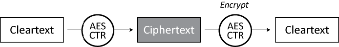

SRT encrypts the media stream at the Transmission Payload level (UDP
payload of MPEG-TS/UDP encapsulation, which is about 7 MPEG-TS packets
of 188 bytes each). A small packet header is required to keep the
synchronization of the cipher counter between the encoder and the
decoders. No padding is required by counter mode ciphers.

What is encrypted is a 128-bit counter, which is then used to do an XOR
with each block of 128 bits in a packet, resulting in the ciphertext to
transmit (this is the XOR technique for counter mode).

The counter for AES-CTR is the size of the cipher‘s block, i.e. 128
bits. It is derived from a 128-bit sequence consisting of (1) a block
counter in the least significant 16 bits, which counts the blocks in a
packet, (2) a packet index —based on the packet sequence number in the
UDT header— in the next 32 bits, and (3) eighty bits that are zeroes.
The upper 112 bits of this sequence are XORed with an initialization
vector (IV) to produce a unique counter for each crypto block. Note that
the block counter is unique for the duration of the session. The same
counter cannot be used twice.

This key used for encryption is called the “Stream Encrypting Key”
(SEK), which is used for 2^25 packets. The short-lived SEK is generated
by the sender using a pseudo-random number generator (PRNG), and
transmitted within the stream (KM Tx Period), wrapped with another
longer-term key, the Key Encrypting Key (KEK), using a known AES key
wrap protocol.

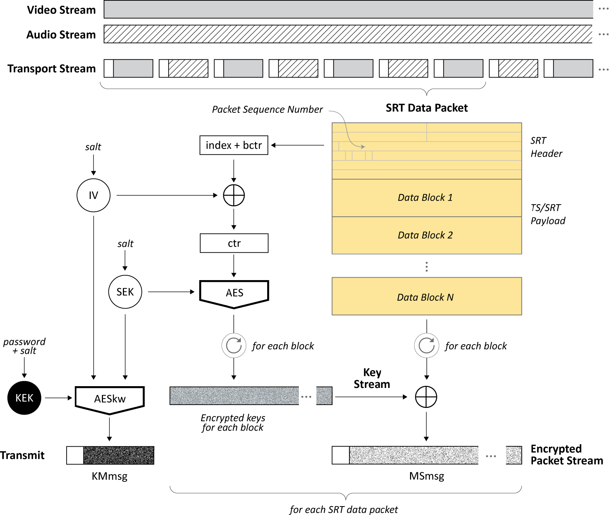

For connection-oriented transport such as SRT, there is no need to
periodically transmit the short-lived key since no party can join the
stream at any time. The keying material is transmitted within the
connection handshake packets, and for a short period when rekeying
occurs.

The KEK is derived from a secret shared between the sender and the
receiver. The shared secret provides access to the stream key, which
provides access to the protected media stream. The distribution and
management of the secret is more flexible than the stream encrypting
key.

The KEK has to be at least as long as the SEK. So, for example, to
protect with AES-256, the KEK should use AES-256 as well. Protecting a
256-bit key with one that is 128 bits would weaken the security. For
this reason, the SEK configuration is used to generate the KEK.

The KEK is generated by a password-based key generation function
(PBKDF2), which uses the passphrase, a number of iterations (2048), a
keyed-hash (HMAC-SHA1), and a length KEYLEN. The PBKDF2 function hashes
the passphrase to make a long string, by repetition or padding. The
number of iterations is based on how much time can be given to the
process without it becoming disruptive.

The KEK is used to generate a wrap that is put in a key material (KM)
message to send to the receiver. The KM message contains the key length,
the salt (one of the arguments provided to the PBKDF2 function), the
protocol being used (AES-256 in this case) and the AES counter (which
will eventually change).

On the other side, the receiver attempts to decode the wrap to obtain
the key. In the protocol for the wrap there is a padding, which is a
known template, so the receiver knows from the KM that it has the right
KEK to decode the SEK. The SEK (generated and transmitted by the sender)
is random, and cannot be known in advance. The KEK formula is calculated
on both sides, with the difference that the receiver gets the key length
(KEYLEN) from the sender via the key material (KM). It is the sender who
decides on the configured length. The receiver obtains it from the
material sent by the sender. This is why the length is not configured on
a decoder, thus avoiding the need to match.

The receiver returns the same KM message to show that it has the same
information as the sender, and that the encoded material will be
decrypted. If the receiver does not return this status, this means that
any encrypted packets from the sender will be lost. Even if they are
transmitted successfully, the receiver will be unable to decrypt them,
and so will be dropped.In the UDT design, even if one peer could not
decrypt, this did not mean that others shouldn‘t receive the
information. In UDT, the key exchange is a one way process, where the
key is regularly injected into a stream so that it can be received at
any time. But with SRT the connection is established in the beginning,
so the key exchange happens then. It can‘t be done just anywhere in the
stream.

The sequence number starts randomly in an SRT handshake. So when packet
encryption starts, the encryption library counts the packets themselves.
This is where the key regeneration is programmed.

The short lived SEK is regenerated for cryptographic reasons when enough
packets have been encrypted with it (KM Refresh Rate). Currently the
default is 2^25, with a pre-announcement period of 4000 packets (i.e. a
new key is generated, wrapped, and sent at 2^25 minus 4000 packets).
Even and odd keys\[13\] are alternated this way. The packets with the
earlier key (we‘ll call it key \#1, or “odd”) will continue to be sent.
The receiver will receive the new key \#2 (even), then decrypt and
unwrap it. The receiver will reply to the sender if it is able to
understand. Once the sender gets to the 2^25 packet using the odd key
(key \#1), it will then start to send packets with the even key (key
\#2). It knows that the receiver has what it needs to decrypt (SEK \#2).
This happens transparently, from one packet to the next. At 2^25 plus
4000 packets the first key will be decommissioned automatically.

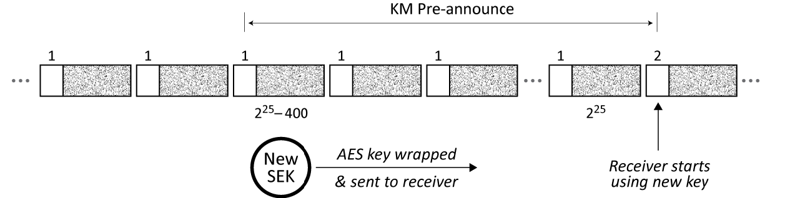

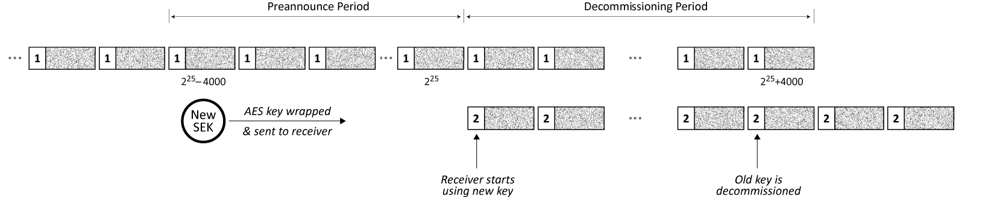

The keys live in parallel for a certain period of time. A bit before and
a bit after the 2^25 mark there are two keys that exist in parallel, in
case there is retransmission. It is possible for packets with the older
key to arrive at the receiver a bit late. Each packet contains a
description of which key it requires, so the receiver will still have
the ability to decrypt it.

KM Refresh Rate and KM Pre-Announce are system parameters that can be
configurable options if shorter time than the cryptographic limit is
required (for example, to limit the material obtained from a compromised
SEK).

In terms of the encryption capabilities of sender and receiver for the
different versions of SRT, in the beginning it wasn‘t complicated. In
HSv4, the UDT handshake occurs first, over a period of 2 x RTT. Then
comes the SRT extension exchange, following which the sender would send
the key material to the receiver, which was acknowledged with a response
packet. All of this takes an additional 2 x RTT.

More recent versions of SRT consolidate everything in the handshake
itself. In the new HSv5, the keying material piggybacks on the second
round-trip, including the response. The handshake initiator sends the
key length, and then the key material exchange happens on the last trip.

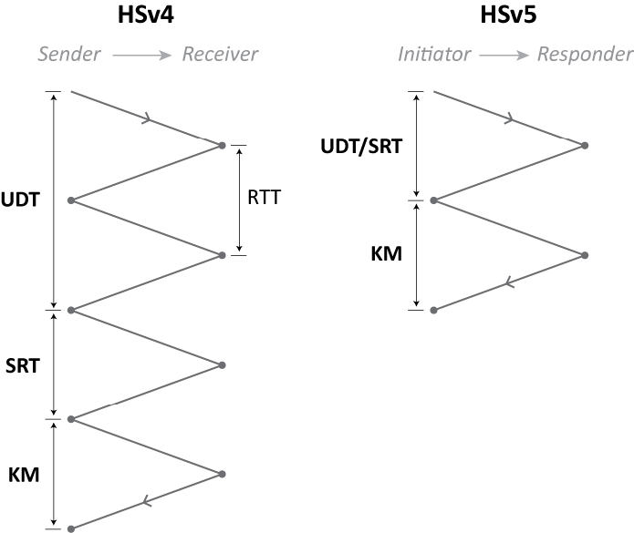

In Haivision products, for example, the key length is configured on the
sender, then sent to the receiver, which will generate its keying
material based on that value, and send a response back to the sender.
But this can be configured in another way. There is no obligation to
have the same set of keys for transmission and reception.

### Definitions

This section defines the elements of the SRT encryption mechanism.

**Ciphers (AES-CTR)**

The payload is encrypted with a cipher in counter mode (AES-CTR). The
AES counter mode is one of the only cipher modes suitable for continuous
stream encryption that permits decryption from any point, without access
to start of the stream (random access), and for the same reason
tolerates packet lost. The Electronic Code Book (ECB) mode also has
these characteristics but does not provide serious confidentiality and
is not recommended in cryptography.

Integrity protection might eventually be achieved with an Authenticated
Encryption with Associated Data (AEAD) cipher such as AES-CCM or
AES-GCM. These cipher modes remove the need of a separate message
authentication protocol such as SHA-2.

**Media Stream Message (MSmsg)**

The Media Stream message is formed from the SRT media stream (data)
packets with some elements of the SRT header used for the cryptography.
An SRT header already carries a 32-bit packet sequence number that is
used for the cipher‘s counter (ctr), with 2 bits taken from the header‘s
message number (which is thereby reduced to 27 bits) for the encryption
key (odd/even) indicator. Note that the message number field is used
when messages larger than the MTU are send, which is not the case for
TS/SRT so the reduction to 27 bits is without consequence.

**Keying Material**

For each stream, the sender generates a Stream Encrypting Key (SEK) and
a Salt (not shown in Figure 1). For the initial implementation and for
most envisioned scenarios where no separate authentication algorithm is
used for message integrity, the SEK is used directly to encrypt the
media stream. The Initial Vector (IV) for the counter is derived from
the Salt only. In other scenarios, the SEK can be used along with the
Salt as a key generating material to produce distinct encryption,
authentication, and salt keys.

**Stream Encrypting Key (SEK)**

The Stream Encrypting Key (SEK) is pseudo-random and different for each
stream. It must be 128, 192, or 256 bits long for the AES-CTR ciphers.
It is non-persistent and relatively short lived. In a typical scenario
the SEK is expected to last, in cryptographic terms, around 37 days for
a 31-bit counter (2^31 packets / 667 packets/second).

The SEK is regenerated every time a stream starts and does not survive
system reboot. It must be discarded before 2^31 packets are encrypted
(31-bit packet index) and replaced seamlessly using an odd/even key
mechanism described below. SRT is conservative and regenerates the SEK
key every 2^25 packets (\~6 hours in the above scenario of a 667
packets/second stream). Reusing an IV (often called “nonce”) with the
same key on different clear text is a known catastrophic issue of
counter mode ciphers. By regenerating the SEK each time a stream starts
we remove the need for elaborate management of the IV to ensure
uniqueness.

**Initialization Vector (IV)**

The IV (also called “nonce” in the AES-CTR context) is a 112-bit random
number. For the initial implementation of SRT and for most envisioned
scenarios where no separate authentication algorithm is used for message
integrity (Auth=0), the IV is derived from the salt only.

IV = MSB(112, Salt) ; Most significant 112 bits of the salt.

**Counter (ctr)**

The counter for AES-CTR is the size of the cipher‘s block, i.e. 128
bits. It is based on a block counter in the least significant 16 bits,
for counting blocks of a packet, a packet index in the next 32 bits, and
80 zeroed bits. The upper 112 bits are XORed with the IV to produce a
unique counter for each crypto block.

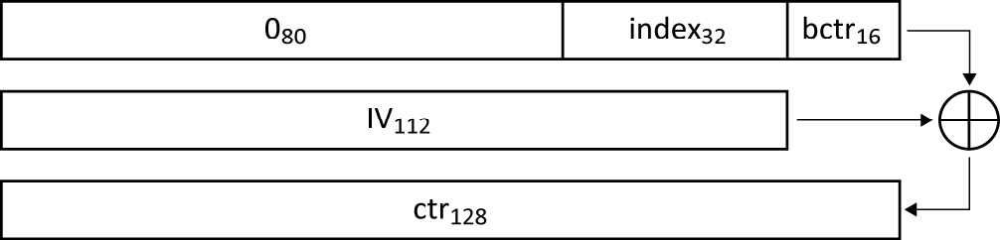

The block counter (bctr) is incremented for each cipher block while
producing the key stream. The packet index is incremented for each
packet submitted to the cipher. The IV is derived from the Salt provided
with the Keying Material.

**Keying Material message (KMmsg)**

The SEK and a salt are transported in-stream, in a Keying Material
message (KMmsg), implemented as a custom SRT control packet, wrapped
with a longer term Key Encrypting Key (KEK) using AES key wrap\[14\]
\[RFC3394\].

Transmitting a key in-band is not original to the SRT protocol. It is
used in DVB MPEG-TS where the stream encrypting key is transmitted in an
Entitlement Control Message (ECM). It is also proposed in an IETF draft
for SRTP for Encrypted Key Transport \[SRTP-EKT\].

The connection-oriented SRT KM control packet is transmitted at the
start of the connection, before any data packet. In most cases, if the
control packet is not lost, the receiver is able to decrypt starting
with the first packet. Otherwise, the initial packets are dropped (or
stored for later decryption) until the KM control packet is received (he
SRT control packet is retransmitted until acknowledged by the receiver).

**Odd/Even Stream Encrypting Key (oSEK/eSEK)**

To ensure seamless rekeying for cryptographic (counter exhausted) or
access control reasons, SRT employs a two-key mechanism, similar to the
one used with DVB systems. The two keys are identified as the odd key
and the even key (oSEK/eSEK). An odd/even flag in the SRT data header
tells which key is in use. The next key to be used is transmitted in
advance (KM Pre-Announce) to the receivers in an SRT control packet.
When rekeying occurs, the SRT data header odd/even flag flips, and the
receiver already has the new key in hand to continue decrypting the
stream without missing a packet.

**Key Encrypting Key (KEK)**

The Key Encrypting Key (KEK) is used by the sender to wrap the SEK, and
by the receiver to unwrap it and then decrypt the stream. The KEK must
be at least the size of the key it protects, the SEK. The KEK is derived
from a shared secret, a pre-shared password by default.

The KEK is derived with the PBKDF2 \[PCKS5\] derivation function with
the stream Salt and the shared secret for input. Each stream then uses a
unique KEK to encrypt its Keying Material. A compromised KEK does not
compromise other streams protected with the same shared secret (but a
compromised shared secret compromises all streams protected with KEK
derived from it). Late derivation of the KEK using stream Salt also
permits the generation of a KEK of the proper size, based on the size of
the key it protects.

The shared secret can be pre-shared; password derived \[PKCS5\];
distributed using a proprietary mechanism, or by using a standard key
distribution mechanism such as GDOI \[RFC 3547\] or MIKEY \[RFC 3830\].

The cryptographic usage limit of the KEK is 248 wraps (AESKW) which
means virtual infinity at the expected SEK rekeying rate (90,000 years
to rekey 100 keys every second).

###   

### Encryption Process Walkthrough

**Stream configuration**

In the simplest stream protection form, a stream is configured with a
password (preferably a passphrase) to enable encryption. The sender
decides to protect or not. On the receiver, a configured a passphrase is
used only if the incoming media stream is encrypted. A receiver knows
that a received stream is encrypted and how (cipher/key length), based
on the received stream itself — not because it has a password
configured.

In the absence of security policies, operators and admins can perform
this task. The only other parameter to set in the initial implementation
of SRT, which uses only AES-CTR, is the key size (actually the code
book): 128, 192, or 256. This can be configured as fast, medium, or
strong encryption.

A system-wide stream protection passphrase (and other crypto parameters)
can also be set by a Security Officer. On the sender, a stream can be
protected by only enabling encryption (using a system-wide passphrase
derived key). On the receiver, no specific setting is required if the
decoder detects encryption from the received stream and has access to
the system-wide passphrase to decrypt it.

The Security Officer could also set policies to force stream encryption
for all streams created by operators and admins, limit the cipher and
key size selection, etc.

**Keying Material Generation**

*SEK, Salt, and KEK*

For each protected stream, the encoder generates a random SEK and Salt.
In the case of a pre-shared password derived key, it derives the KEK
from the pre-shared secret and the 64 least significant bits of the
Salt.

SEK = PRNG(Klen)

Salt = PRNG(128)

KEK = PBKDF2(password, LSB(64,Salt), Iter, Klen)

…where PRNG is a pseudo-random number generator, Klen is the key length
(128, 192, 256), PBKDF2 is the PKCS \#5 Password Based Key Derivation
Function 2.0, and Iter is the iteration count (2048). For proper
protection, the KEK must be at least as long as the key it protects.

**KMmsg**

The encoder assembles the Keying Material message once for the life of
the SEK and transmits it periodically. It may be assembled twice if the
2nd key (odd and even) is later added and transmitted in the same
message for seamless rekeying (SEK = eSEK || oSEK).

Wrap = AESkw(KEK, SEK)

KMmsg = Header || CryptoInfo || Wrap

**Encryption and Transmission**

**KMmsg Transmission (KM Tx Period)**

The sender transmits the KMmsg periodically (ex: every second).

**Key Stream Generation**

When a co-processor is used for cryptography the key stream can be
generated in parallel, in advance of the media stream. The initial
counter is generated from the IV and the Salt.

IV = MSB(112, Salt)

ctr = (IV112 || 016) XOR (index32 || 016)

KeyStream\[index\] = AES(SEK, ctr) || AES(SEK, ctr+1) || ... || AES(SEK,
ctr+n-1)

index = index+1

…where n is the number of 128 bits block in the payload.

**Media Stream Message Generation**

The TS/UDP payload is XORed with the Key stream:

MSmsg\[index\] = Header || index || (KeyStream\[index\] XOR
payload\[index\])

**Reception and Decryption**

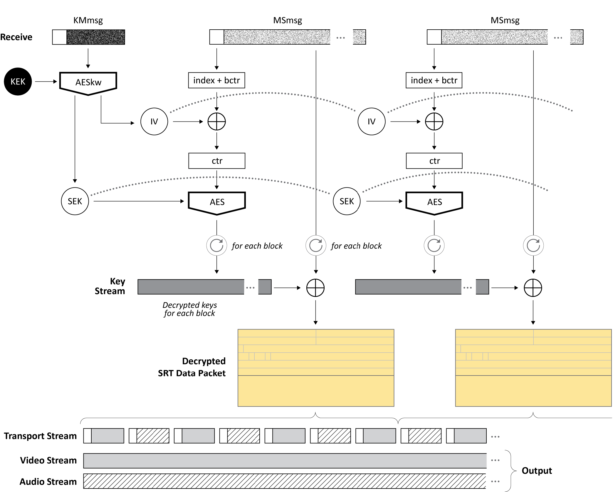

**Detect Encryption**

The receiver of a stream can detect from the message whether or not the
stream is encrypted.

**Regenerate the KEK, SEK and IV**

If the receiver does not have the Keying Material, it waits for a KMmsg
to extract the Salt and Wrap. With the pre-shared password and the Salt
it regenerates the KEK and then unwrap the SEK. It checks the Wrap
integrity from the Integrity Check Vector.

KEK = PBKDF2(password, Salt, Iter, Klen)

ICV || SEK = AESkw(KEK, Wrap)

**Generate Key Stream**

With the next stream message (MSmsg) the receiver grabs the packet
counter and odd/even key flag from the clear text header and primes the
cipher to generate a key stream for some packets in advance.

**Counter Preset**

As an optimization, while waiting for the first KMmsg, the decoder can
grab the packet counter and odd/even flag from the stream message
(MSmsg) received before the KMmsg and know what the packet counter of
the next MSmsg should be, then prime the cipher earlier.

**Early Frames vs. Latency**

Where the key stream is generated in any arrangement where a crypto
processor can process the key stream in parallel, there is a choice
between displaying the earlier frames received or achieving low latency.

When a decoder has primed the cipher to generate the key stream, it has
the choice to (1) store the received stream packets until the key stream
is ready, and then display the earliest received frame with some latency
(the lag between the first packet buffered and the first packet
decrypted and displayed), or (2) drop the early packets until the key
stream is ready, and then achieve lower latency. It is assumed here that
the crypto engine can thereafter generate the key stream as fast as it
receives MSmsg.

The same reasoning applies when encrypted packets are received before
the keying material at the start of a session. With TS/SRT, KMmsg is
sent right after connection before any media stream packet, but it can
be lost, and a retransmitted KMmsg can reach the receiver after the
initial encrypted packets. SRT adds artificial latency to permit
retransmission of lost packets, so it can enqueue encrypted packet and
decrypt them upon delivery to the receiving application instead of upon
reception.

While it would be possible to buffer the received stream packets before
receiving the KMmsg, there is no guarantee that the odd or even key used
to encrypt these messages is the one encrypted in the KMmsg received
after, especially if backward secrecy is achieved (where a new receiver
cannot decrypt an earlier stream).

###   

### Messages

**Data Message Header**

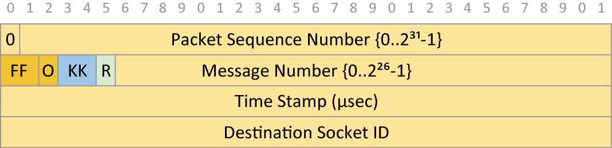

| **Field** | **Bits** | **Value** | **Description**                                                      |
| --------- | -------- | --------- | -------------------------------------------------------------------- |
| 0         | 1        | 0         | SRT Data|Control packet identifier 0:data 1:control                  |
| FF        | 3        |           | Packet Position in message 10:first 00:middle 01:last 11:only packet |
| KK        |          |           | Odd/even encryption Key indicator 10:odd 01:even                     |
| R         | 1        |           | (≥ libsrt 1.3)                                                       |

**SRT Control Message Header**

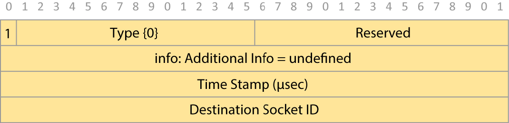

| **Field** | **Bits** | **Value** | **Description**                 |
| --------- | -------- | --------- | ------------------------------- |
| 1         | 1        | 1         | SRT control packet identifier   |
| Type      | 15       | 0x7FFF    | SRT control packet type: custom |

**SRT Keying Material Control Message (KMmsg)**

The Keying Material message provides the information to decrypt the
Media Stream message payload.

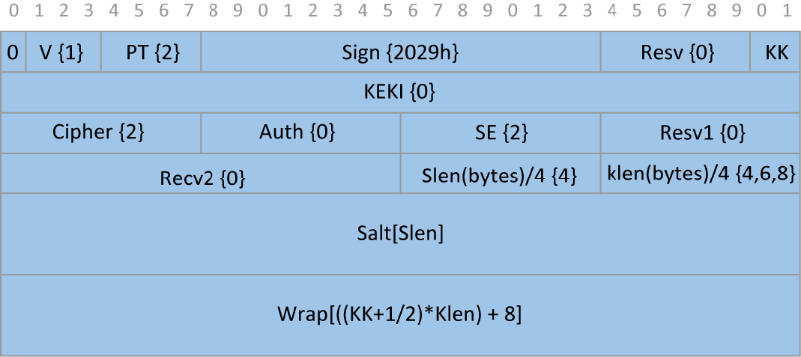

|**Field**|**Bits**|**Value**|**Description**|
|--- |--- |--- |--- |
|0|1|0|Remnant from past header|
|Ver|3||SRT version|
|||1|Initial version|
|PT|4||Packet Type|
|||0|Reserved|
|||1|MSmsg|
|||2|KMmsg (always)|
|||7|Reserved to discriminate MPEG-TS packet (0x47=sync byte)|
|Signature|16|0x2029|Signature (‘HAI‘ PnP Vendor ID in big endian order)|
|Resv|4|0|Reserved for flag extension or other usage|
|KEKI|32||KEK index (big endian order)|
|||0|Default stream associated key (stream/system default)|
|||1..255|Reserved for manually indexed keys|
|Cipher|8||Encryption cipher and mode|
|||0|None or KEKI indexed crypto context|
|||1|AES-ECB (potentially for VF 2.0 compatible message)|
|||2|AES-CTR [FP800-38A]|
|||x|AES-CCM [RFC3610] if message integrity required (FIPS 140-2 approved)|
|||x|AES-GCM if message integrity required (FIPS 140-3 & NSA Suite B)|
|Auth|8||Message Authentication Code algorithm|
|||0|None or KEKI indexed crypto context|
|SE|8||Stream Encapsulation|
|||0|Unspecified or KEKI indexed crypto context|
|||1|MPEG-TS/UDP|
|||2|MPEG-TS/SRT|
|Slen/4|4|0..255|Salt length in bytes divided by 4\. Can be zero if no salt/IV present|
|Klen/4|4|0..255|SEK length in bytes divided by 4\. Size of one key even if two keys present.|
|Salt|Slen*8||Salt key|
|Wrap|64+

n*Klen*8||Wrapped key(s)

n = 1 or 2|

**KEKI**

The KEK index (KEKI) tells which KEK was used to wrap (and optionally
authenticate) the SEK(s). With a key management system, the KEKI is used
as one of the parameters (possibly with the IP address and port of the
stream) to retrieve a cryptographic context. In the absence of a key
management system, the value 0 is used to indicate the default key of
the current stream.

If it is required to seamlessly change the KEK for good security
practice (key lifetime elapsed), to preserve backward/forward secrecy
when a new receiver joins/leaves, for a security breach (compromised KEK
or device), or if there are multiple sensitive streams to protect (ex:
secret, sensitive, public, etc.), then the system needs to manage
multiple keys and this fields tells which one to use.

**Auth**

In the eventuality that a separate authentication protocol such as SHA2
is used for message integrity, the SAK (Stream Authentication Key) may
be derived from the SEK instead of being carried in the KMmsg. The SEK
then becomes a Key Generating Key and the Salt a master salt from which
the stream encryption, authentication, and salt keys are derived. This
is the method used for SRTP \[RFC3711\].

**Salt**

This field complements the keying material. It can carry a nonce;
salting key; Initialization Vector, or be used as a generator for them.

**Wrap**

Once KMmsg is unwrapped, the following fields are revealed.

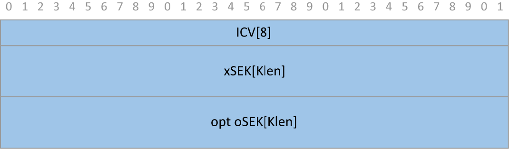

|Field|Bits|Value|Description|
|--- |--- |--- |--- |
|ICV|64||64-bit Integrity Check Vector (AES key wrap integrity)|
|xSEK|Klen*8||Odd or Even key if one key (according to Flags)
Even key if both keys|
|oSEK|Klen*8||Odd key if both keys|

The same KMmsg can carry two keys only if they share the same KEKI and
same length. If there is a security parameter change with SEK rekeying
(key length or new KEKI), then a different KMmsg must be used to carry
the odd and even key.

Note that the same Salt is reused on SEK rekeying. This does not break
the nonce requirement of the counter mode that is used only once for a
given key, and preserves the password-based derived KEK of this stream.

**ICV**

This field is used to detect if the keys were unwrapped properly. If the
KEK in hand is invalid, validation fails and unwrapped keys are
discarded.

**xSEK**

This field identifies an odd or even SEK. If only one key is present,
the bit set in the Flags field tells which one it is. If both keys are
present, then this field is eSEK (even key) and the next one is the odd
key.

**oSEK**

This field is present only when the message carries the two SEKs. This
may be only for a short period before re-keying the stream for a new
receiver to decrypt the current stream, and for all members to prepare
for seamless re-keying.

### Parameters

|Parameter|Cfg|Default|Description||
|--- |--- |--- |--- |--- |
|||TS/UDP|TS/SRT||
|Passphrase|usr|none|none|SIZE[8..80]|
|Encryption (key length)|usr|128|128|none(0), fast (128), medium(192), strong(256)|
|Integrity|usr|0|0|none(0), others... (future)|
|Encryption cipher|sp|CTR|CTR|AES-xxx-CTR|
|AEAD cipher|sp|||AES-xxx-CCM (future)
AES-xxx-GCM (future)|
|Passphrase min length|sp|8|10|[8..80]|
|KM Tx Period (msec)|os|1000||100..60000 milliseconds|
|KM Refresh Rate (packets)|os|2^24|2^24|2^10..2^32 packets
A power of 2 makes implementation easier|
|KM Pre-Announce (packets)|os|2^12
0x1000|0x10000|KM Switch Pre/Post Announce
<= (KM Refresh Rate / 2)|
|PBKDF2 Iterations|sp|2048|2048|>=1000|
|PBKDF2 Hash Function|sp|X|X|SHA-1
SHA-2 (future: PKCS #5 v2.1)|
|PBKDF2 Salt size (bits)|sp|64|64|64 bits|

usr: user configurable, sp: security policy (default: os), os: haios.ini
\[HAICRYPT\]

###   

### Security Issues

**Backward/Forward Secrecy**

Backward secrecy is the confidentiality of past material with respect to
a new member who has obtained the shared secret. If backward secrecy is
required, the shared secret (pre-shared password) must be changed
whenever a new member joins the community, since with in-stream key
distribution, a recorded past encrypted stream can be decrypted with the
shared secret used at that time. With out-of-band key distribution using
access control, a past key could not be obtained without the shared
secret, which is no longer available. Forward secrecy permits denial of
access to the key, such as to a member you previously trusted. This is
different from Perfect Forward Secrecy (PFS) in which a compromised
long-term key (KEK) does not compromise past sessions keys (SEK). PFS is
normally achieved with a key exchange mechanism such as Ephemeral Diffie
Hellman.

**Header Encryption**

While encrypting the whole packet, including protocol headers, may look
more secure, this raises security concerns. Headers have known content
(example: MPEG-TS sync byte 0x47) that facilitates brute force and
dictionary attacks, allowing them to to know they succeeded in cracking
a key (0x47 every 188th byte of the MPEG-TS packet). The remedy against
a brute force attack is a longer key (longer crack time) and shorter key
lifetime (change key before time required to crack with current
technology). The SEK will not last longer than 2^24 packets by default,
but this may be too long at low bit rates. A configurable SEK lifetime
in units of time instead of packets would help (the first limit reached
triggers rekeying).

**Pause, Still Image, Blackout, and Mute**

Pause, still image, blackout, and mute on an encoder shall disable
encryption. Known input encrypted with a different key stream (counter
increasing) is material for hackers.

To preserve confidentiality, a pause shall not display a still frame of
the input signal unencrypted but shall blackout when disabling
encryption.

**Stream Protection Policy**

In some installations, the audio/video input of an encoder might be too
sensitive for a Security Officer to risk the possibility of operators or
admins sending out unprotected streams. On such systems, the SO would
configure a system-wide encryption pre-shared password (independent of
the streams), and set a policy to force stream encryption.

**Storage**

Password-derived keys are unique for each stream, so what is pre-shared
is the password. It must not be stored in the default configuration file
readable by all, nor be dumped or listed in any trace. A system security
module can be used to store or encrypt the password. A shadow system
with a reference in the configuration file to the password stored in a
shadow file only readable by root may be sufficient.

**Configuration Sanity**

It is preferable not to configure passwords or keys using telnet or
HTTP, even if the password is obfuscated on the screen, if it is carried
in the clear between the configuration system and the sender/receiver. A
system‘s CLI and Web interface shall be able to detect SSH/HTTPS (vs.
telnet/HTTP) to permit security information settings only when they can
securely do so.

**KEK Size**

The KEK size cannot be smaller than the SEK to wrap. With a password
derived KEK, the problem is solved by generating a KEK of the required
size for each stream.

For a KEK from other sources to wrap an SEK of mixed sizes (128, 192,
256 bits), a 256-bit KEK could be used all the time. Performance should
be evaluated to see if using a 256-bit KEK to decrypt a 128-bit SEK
incurs unnecessary delays in stream decoding. An IP core can be used if
a hardware implementation is desirable. Protecting a 128-bit key with a
256-bit KEK provides no more security than with a 128-bit KEK. Another
solution could be to use PBKDF2 even for non-password based KEK
material.

### Implementation Notes

**PBKDF2**

OpenSSL supports the PKCS \#5 Password-Based Key Derivation Function
version 2. The function PKCS5\_PBKDF2\_HMAC\_SHA1 performs this task.

Starting with version 1.0.0, OpenSSL implements the PKCS \#5 version 2.1
added SHA-2 message digest functions for PBKDF2 (SHA224, SHA256, SHA384,
SHA512). The generic function PKCS5\_PBKDF2\_HMAC needs the message
digest algorithm in its parameters.

**AES Key Wrap**

OpenSSL supports the AES key wrap as defined in RFC3394 with the
functions AES\_wrap\_key() and AES\_unwrap\_key(). To support material
size that is not a multiple of 64 bits, standard padding for AESkw
\[RFC5649\] is used.

**KMmsg Caching**

The KMmsg shall be cached on both the sender and receiver to prevent
encrypting/decrypting the same message over and over again. PKCS \#5 is
CPU intensive. Senders retransmit cached KMmsg periodically (KM Tx
Period) as long as it is valid(TS/UDP) or until it is
acknowledged(TS/SRT). Receivers compare the received KMmsg to the cached
KMmsg and discard it without decrypting it if nothing has changed.

At the expense of some transmission and CPU bandwidth, message integrity
can be added to whole KMmsg using the ANS X9.102 AESKW mechanism. The
OpenSSL AES key wrap functions can be used but with a different input,
also providing a longer output.

**Limitations**

(1) Encryption applies only to data packets, and not the header, which
is needed for decrypting because it contains the sequence number
(counter) needed to regenerate the decryption key.

(2) It is currently not possible to route an encrypted SRT stream via an
intermediate device, such as a gateway. The keys are exchanged during
the handshake, and the handshake is point-to-point. Introducing an
intermediate device would require another session, and therefore another
counter.

End-to-end encryption would require the ability to pull the counter out
and insert it in another packet — to force the counter, instead of
depending on a random number, so that the sequence at the other end
would be able to be decrypted.

Making encryption work without having the intermediate devices decrypt
would be practical for a cloud service. But the problem is in the
sequence number because it is determined at the moment of the SRT
handshake by exchanging a random number. To do this end-to-end would
require propagating the handshake from one end to the other by pulling
it out of the ancillary data, and then re-injecting it in the
appropriate place.

As a packet with a sequence number and encrypted payload passes through
an intermediate device, there is another session, and therefore another
sequence. The packet‘s ciphertext payload would have to be put into a
new packet with a new sequence number.

##   

## SRT Handshake

### Overview

SRT is a connection protocol, and as such it embraces the concepts of
*connection* and *session*. The UDP system protocol is used by SRT for
sending data as well as special control packets, also referred to as
*commands*.

An SRT connection is characterized by the fact that it is:

  - > first engaged by a *handshake* process

  - > maintained as long as any packets are being exchanged in a timely
    > manner

  - > considered closed when a party receives the appropriate close
    > command from its peer (connection closed by the foreign host), or
    > when it receives no packets at all for some predefined time
    > (connection broken on timeout).

Just like its predecessor UDT, SRT supports two connection
configurations:

1.  > Caller-Listener, where one side waits for the other to initiate a
    > connection

2.  > Rendezvous, where both sides attempt to initiate a connection

As SRT development has evolved, two handshaking mechanisms have emerged:

1.  > the legacy UDT handshake, with the “SRT” part of the handshake
    > implemented as extended control messages; this is the only
    > mechanism in SRT versions 1.2 and lower, and is known as HSv4
    > (where the number 4 refers to the last UDT version)

2.  > the new integrated handshake, known as HSv5, where all the
    > required information concerning the connection is interchanged
    > completely in the handshake process

The version compatibility requirements are such that if one side of the
connection only understands HSv4, the connection is made according to
HSv4 rules. Otherwise, if both sides are at SRT version 1.3.0 or
greater, HSv5 is used. As the new handshake supports several features
that might be mandatory for a particular application, it is also
possible to reject an HSv4-to-HSv5 connection by setting the
SRTO\_MINVERSION socket option. The value for this option is an integer
with the version encoded in hex. For example:

int req\_version = 0x00010300; // 1.3.0

srt\_setsockflag(s, SRTO\_MINVERSION, \&req\_version, sizeof(int));

**IMPORTANT**: An SRT application must do either of these two things:

  - > be HSv4 compatible; in this case it must:
    
      - > NOT use any new features in 1.3.0 or higher (such as
        > bidirectional transmission or Stream ID)
    
      - > ALWAYS set SRTO\_SENDER to true on the sender side

  - > require HSv5; if so, it must prevent connections to any older
    > versions of SRT by setting the minimum version 1.3.0 as shown
    > above.

### Handshake Structure

The control information field of the handshake control packet, which
comes immediately after the UDT header and SRT header, consists of the
following 32-bit fields in order:

| **Field**        | **Description**                                                                                                                                 |
| ---------------- | ----------------------------------------------------------------------------------------------------------------------------------------------- |
| *Version*        | Contains number 4 in SRT before 1.3.0 (HSv4). It contains 4 or 5 (HSv5) depending on the handshake phase in SRT 1.3.0 and higher.               |
| *Type*           | In SRT before 1.3.0 (HSv4) must be the value of SOCK\_DGRAM, which is 2. For usage in later versions of SRT see the “Type field” section below. |
| *ISN*            | Initial Sequence Number; the sequence number for the first data packet                                                                          |
| *MSS*            | Maximum Segment Size, which is typically 1500, but can be less                                                                                  |
| *FlightFlagSize* | Maximum number of buffers allowed to be “in flight” (sent and not ACK-ed)                                                                       |
| *ReqType*        | Request type (see below)                                                                                                                        |
| *ID*             | The SOURCE socket ID from which the message is issued (destination socket ID is in SRT header)                                                  |
| *Cookie*         | Cookie used for various processing (see below)                                                                                                  |
| *PeerIP*         | Placeholder for the sender‘s IPv4 or IPv6 IP address, consisting of four 32-bit fields                                                          |

Here is a representation of the HSv4 handshake structure (which follows
immediately after the SRT control packet header):

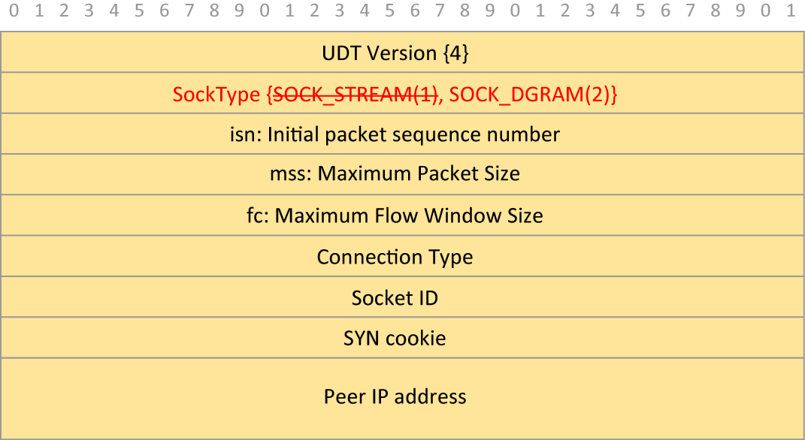

And here is the equivalent portion of the HSv5 handshake structure (to
simplify the comparison here, the extended portion of the HSv5 handshake
structure is not shown. See the “UDT Legacy” and “SRT Extended”
Handshakes section for details):

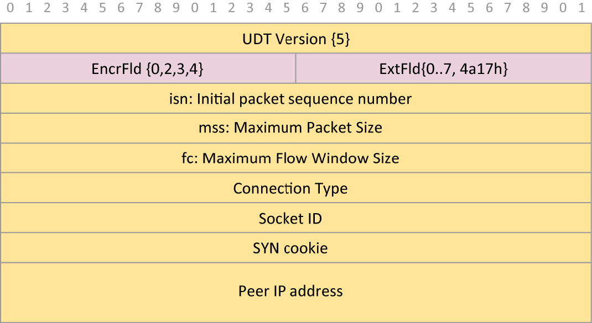

The HSv4 (UDT-legacy based) handshake is based on two rules:

1.  > The complete handshake process, which establishes the connection,
    > is the same as the UDT handshake.

2.  > The required SRT data interchange is done after the connection is
    > established using SRT Extended Message with the following Extended
    > Types:
    
      - > SRT\_CMD\_HSREQ/SRT\_CMD\_HSRSP, which exchange special SRT
        > flags as well as a latency value
    
      - > SRT\_CMD\_KMREQ/SRT\_CMD\_KMRSP (optional), which exchange the
        > wrapped stream encryption key used with encryption (KMRSP is
        > used only for confirmation or error reporting)

**IMPORTANT**: *There are two rules in the UDT code that continue to
apply to SRT version 1.2.0 and earlier, and therefore affect the
prerequisites for any future versions of the protocol:*

1.  > *The initial handshake response message coming from the Listener
    > side DOES NOT REWRITE the Version field (it‘s simply blindly
    > copied from the handshake request message received).*

2.  > *The size of the handshake message must be exactly equal to the
    > legacy UDT handshake structure, otherwise the message is silently
    > rejected.*

As of SRT version 1.3.0 with HSv5 the handshake must only satisfy the
minimum size. However, the code cannot rely on this until each peer is
certain about the SRT version of the other.

Even in HSv5, the Caller must first set two fields in the initial
handshake message:

  - > Version = 4

  - > Type = UDT\_DGRAM

The version recognition relies on the fact that the Listener returns a
version of 5 (or potentially higher) if it is capable, but the Caller
must set the Version to 4 to make sure that the Listener copies this
value, which is how an HSv4 caller is recognized. This allows SRT to
handle the following combinations:

1.  > HSv5 Caller vs. HSv4 Listener: The Listener returns version 4 to
    > the Caller, so the Caller knows it should use HSv4, and then
    > continues the handshake the old way.

2.  > HSv4 Caller vs. HSv5 Listener: The Caller sends version 4 and the
    > Listener returns version 5. The Caller ignores this value,
    > however, and sends the second phase of the handshake still using
    > version 4. This is how the Listener recognizes the HSv4 client.

3.  > Both HSv5: The Listener responds with version 5 (or potentially
    > higher in future) and the HSv5 Caller recognizes this value as
    > HSv5 (or higher). The Caller then initiates the second phase of
    > the handshake according to HSv5 rules.

With Rendezvous there‘s no problem because both sides try to connect to
one another, so there‘s no copying of the handshake data. Each side
crafts its own handshake individually. If the value of the Version field
is 5 from the very beginning, and if there are any extension flags set
in the Type field (see note below), the rules of HSv5 apply. But if one
party is using version 4, the handshake continues as HSv4.

**NOTE**: *Previously, the SocketType field contained only the extension
flags, but now it also contains the encryption flag. For HSv5 rules to
apply the extension flag needs to be expressly set*.

### The “Legacy” and “SRT Extended” Handshakes

**Legacy Handshake**

The first versions of SRT did not change anything in the UDT handshake
mechanisms, which are identified as HSv4. Here the connection process is
the same as it was in UDT, and any extended SRT handshake operations are
done after the HSv4 handshake is done and connection established.

The HSv5 handshake was first introduced in SRT version 1.3.0. It
includes all the extended SRT handshake operations in the overall
handshake process (known as “integrated handshake"), which means that
these data are considered exchanged and agreed upon at the moment when
the connection is established.

**Initiator and Responder**

The addition of a new handshake mechanism necessitates the introduction
of two new roles, “Initiator” and “Responder”:

  - > *Initiator:* Starts the extended SRT handshake process and sends
    > appropriate SRT extended handshake requests

  - > *Responder:* Expects the SRT extended handshake requests to be
    > sent by the Initiator and sends SRT extended handshake responses
    > back

There are two basic types of SRT handshake extensions that are exchanged
in both handshake versions (HSv5 introduces some more extensions):

  - > SRT\_CMD\_HSREQ: Exchanges the basic SRT information

  - > SRT\_CMD\_KMREQ: Exchanges the wrapped stream encryption key (used
    > only if encryption is requested)

The Initiator and Responder roles are assigned differently in *HSv4* and
*HSv5*.

For an *HSv4* handshake the assignments are simple:

  - > Initiator is the sender, which is the party that has set the
    > SRTO\_SENDER socket option to *true*.

  - > Responder is the receiver, which is the party that has set
    > SRTO\_SENDER to *false* (default).

Note that these roles are independent of the connection mode
(Caller/Listener/Rendezvous), and that the behavior is undefined if
SRTO\_SENDER has the same value on both parties.

For an *HSv5* handshake, the roles are dependent of the connection mode:

  - > For Caller-Listener connections:
    
      - > the Caller is the Initiator
    
      - > the Listener is the Responder

  - > For Rendezvous connections:
    
      - > The Initiator and Responder roles are assigned based on the
        > initial data interchange during the handshake (see
        > [The Rendezvous
        > Handshake](#_jm2aioq6cifh) below)

Note that if the handshake can be done as HSv5, the connection is always
considered bidirectional and the SRTO\_SENDER flag is unused.

**The Request Type Field**

The ReqType field in the Handshake Structure (see above) indicates the
handshake message type.

  - > Caller-Listener Request Types:
    
    1.  > Caller to Listener: INDUCTION(1)
    
    2.  > Listener to Caller: INDUCTION(1): reports cookie
    
    3.  > Caller to Listener: CONCLUSION(-1): uses previously returned
        > cookie
    
    4.  > Listener to Caller: CONCLUSION(-1): confirms connection
        > established

<!-- end list -->

  - > Rendezvous Request Types:
    
    1.  > After starting the connection: WAVEAHAND(0)
    
    2.  > After receiving the above message from the peer:
        > CONCLUSION(-1)
    
    3.  > After receiving the above message from the peer:
        > AGREEMENT(-2).

Note that the Rendezvous process is different in HSv4 and HSv5, as the
latter is based on a state machine.

**The Type Field**

There are two possible interpretations of the Type field. The first is
the legacy UDT “socket type”, of which there are two: STREAM(1) and
DGRAM(2). In SRT only UDT\_DGRAM is allowed. This legacy interpretation
is applied in the following circumstances:

  - > in an INDUCTION message sent initially by the Caller

  - > in an INDUCTION message sent back by the HSv4 Listener

  - > in a CONCLUSION message, if the other party was detected as HSv4

For more information on Induction and Conclusion see the Caller-Listener
Handshake section below.

UDT interpreted the Type field as either a Stream or Datagram type, and
rejected the connection if the parties each used a different type. Since
SRT only uses the Datagram type, HSv5 uses only the DGRAM value for this
field in cases where the message is going to be sent to an HSv4 party
(which follows the UDT interpretation).

In all other cases Type follows the HSv5 interpretation and consists of
the following:

  - > an upper 16-bit field (0 - 15) reserved for encryption flags

  - > a lower 16-bit field (16 - 31) reserved for extension flags

The extension flags field should have the following value:

  - > in a CONCLUSION message, it should contain a combination of
    > extension flags (with the HS\_EXT\_ prefix)

  - > in an INDUCTION message sent back by the Listener it should
    > contain SrtHSRequest::SRT\_MAGIC\_CODE (0x4A17)

  - > in all other cases it should be 0.

The encryption flags currently occupy only 3 out of 16 bits, which are
used to advertise a value for PBKEYLEN (packet based key length). This
value is taken from the SRTO\_PBKEYLEN option, divided by 8, giving
possible values of:

  - > 2 (AES-128)

  - > 3 (AES-192)

  - > 4 (AES-256)

  - > 0 (PBKEYLEN not advertised)

The PBKEYLEN advertisement is required due to the fact that while the
Sender should decide the PBKEYLEN, in HSv5 the Sender might be the
Responder. Therefore PBKEYLEN is advertised to the Initiator so that it
gets this value before it starts creating the SEK on its side, to be
then sent to the Responder.

**REMINDER**: *Initiator and Responder roles are assigned differently in
HSv4 and HSv5. See the Initiator and Responder section above.*

The specification of PBKEYLEN is decided by the Sender. When the
transmission is bidirectional, this value must be agreed upon at the
outset because when both are set, the Responder wins. For
Caller-Listener connections it is reasonable to set this value on the
Listener only. In the case of Rendezvous the only reasonable approach is
to decide upon the correct value from the different sources and to set
it on both parties (note that AES-128 is the default).

###   

### The Caller-Listener Handshake

This section describes the handshaking process where a Listener is
waiting for an incoming packet on a bound UDP port, which should be an
SRT handshake command (UMSG\_HANDSHAKE) from a Caller. The process has
two phases: *induction* and *conclusion*.

**The Induction Phase**

The Caller begins by sending an “induction” message, which contains the
following (significant) fields:

  - > Version: must always be 4

  - > Type: UDT\_DGRAM (2)

  - > ReqType: URQ\_INDUCTION

  - > ID: Socket ID of the Caller

  - > Cookie: 0

The Destination Socket ID (in the SRT header) in this message is 0,
which is interpreted as a connection request.

**NOTE**: *This phase serves only to set a cookie on the Listener so
that it doesn‘t allocate resources, thus mitigating a potential DOS
attack that might be perpetrated by flooding the Listener with handshake
commands.*

An HSv4 Listener responds with exactly the same values, except:

  - > ID: Socket ID of the HSv4 Listener

  - > SYN Cookie: a cookie that is crafted based on host, port and
    > current time  
    > with 1 minute accuracy

An HSv5 Listener responds with the following:

  - > Version: 5

  - > Type: Extension Field (lower 16 bits):
    > SrtHSRequest::SRT\_MAGIC\_CODE  
    > Encryption Field (upper 16 bits): Advertised PBKEYLEN

  - > ReqType: (UDT Connection Type) URQ\_INDUCTION

  - > ID: Socket ID of the HSv5 Listener

  - > SYN Cookie: a cookie that is crafted based on host, port and
    > current time  
    > with 1 minute accuracy

**NOTE**: *The HSv5 Listener still doesn‘t know the version of the
Caller, and it responds with the same set of values regardless of
whether the Caller is version 4 or 5.*

The important differences between HSv4 and HSv5 in this respect are:

1.  > The HSv4 party completely ignores the values reported in Version
    > and Type. It is, however, interested in the Cookie value, as this
    > must be passed to the next phase. It does interpret these fields,
    > but only in the “conclusion” message.

2.  > The HSv5 party does interpret the values in Version and Type. If
    > it receives the value 5 in Version, it understands that it comes
    > from an HSv5 party, so it knows that it should prepare the proper
    > HSv5 messages in the next phase. It also checks the following in
    > the Type field:
    
      - > whether the lower 16-bit field (extension flags) contains the
        > magic value (see the [Type
        > Field](#_2t1nw0yacl3m) section above); otherwise the
        > connection is rejected. This is a contingency for the case
        > where someone who, in attempting to extend UDT independently,
        > increases the Version value to 5 and tries to test it against
        > SRT.
    
      - > whether the upper 16-bit field (encryption flags) contain a
        > non-zero value, which is interpreted as an advertised PBKEYLEN
        > (in which case it is written into the value of the
        > SRTO\_PBKEYLEN option).

**The Conclusion Phase**

Once the Caller gets its cookie, it sends a URQ\_CONCLUSION handshake
message to the Listener.

The following values are set by an HSv4 Caller. Note that the same
values must be used by an HSv5 Caller when the Listener has returned
Version 4 in its URQ\_INDUCTION response:

  - > Version: 4

  - > Type: UDT\_DGRAM (SRT must have this legacy UDT socket type only)

  - > ReqType: URQ\_CONCLUSION

  - > ID: Socket ID of the Caller

  - > Cookie: the cookie previously received in the induction phase

If an HSv5 Caller receives a confirmation from a Listener that it can
use the version 5 handshake, it fills in the following values:

  - > Version: 5

  - > Type: appropriate Extension Flags and Encryption Flags (see below)

  - > ReqType: URQ\_CONCLUSION

  - > ID: Socket ID of the Caller

  - > Cookie: the cookie previously received in the induction phase

The Destination Socket ID (in the SRT header, PH\_ID field) in this
message is the socket ID that was previously received in the induction
phase in the ID field in the handshake structure.

The Type field contains:

  - > Encryption Flags: advertised PBKEYLEN (see above)

  - > Extension Flags: The HS\_EXT\_ prefixed flags defined in
    > CHandShake  
    > (see the [SRT Extended Handshake](#_rtjltioug2mc) section below)

The Listener responds with the same values shown above, without the
cookie (which isn‘t needed here), as well as the extensions for HSv5
(which will probably be exactly the same).

**IMPORTANT**: *There isn‘t any “negotiation” here. If the values passed
in the handshake are in any way not acceptable by the other side, the
connection will be rejected. The only case when the Listener can have
precedence over the Caller is the advertised PBKEYLEN in the Encryption
Flags field in Type field. The value for latency is always agreed to be
the greater of those reported by each party.*

### The Rendezvous Handshake

When two parties attempt to connect in Rendezvous mode, they are
considered to be equivalent: Both are connecting, but neither is
listening, and they expect to be contacted (over the same port number
for both parties) specifically by the same party with which they are
trying to connect. Therefore, it‘s perfectly safe to assume that, at
some point, each party will have agreed upon the connection, and that no
induction-conclusion phase split is required. Even so, the Rendezvous
handshake process is more complicated.

The basics of a Rendezvous handshake are the same in HSv4 and HSv5 - the
description of the HSv4 process is a good introduction for HSv5.
However, HSv5 has more data to exchange and more conditions to be taken
into account.

**HSv4 Rendezvous Process**

Initially, each party sends an SRT control message of type
UMSG\_HANDSHAKE to the other, with the following fields:

  - > Version: 4 (HSv4 only)

  - > Type: UDT\_DGRAM (HSv4 only)

  - > ReqType: URQ\_WAVEAHAND

  - > ID: Socket ID of the party sending this message

  - > Cookie: 0

When the srt\_connect() function is first called by an application, each
party sends this message to its peer, and then tries to read a packet
from its underlying UDP socket to see if the other party is alive. Upon
reception of anUMSG\_HANDSHAKE message, each party initiates the second
(conclusion) phase by sending this message:

  - > Version: 4

  - > Type: UDT\_DGRAM

  - > ReqType: URQ\_CONCLUSION

  - > ID: Socket ID of the party sending this message

  - > Cookie: 0

At this point, they are considered to be connected. When either party
receives this message from its peer again, it sends another message with
the ReqType field set as URQ\_AGREEMENT. This is a formal conclusion to
the handshake process, required to inform the peer that it can stop
sending conclusion messages (note that this is UDP, so neither party can
assume that the message has reached its peer).

With HSv4 there‘s no debate about who is the Initiator and who is the
Responder because this transaction is unidirectional, so the party that
has set the SRTO\_SENDER flag is the Initiator and the other is
Responder (as is usual with HSv4).

**HSv5 Rendezvous Process**

The HSv5 Rendezvous process introduces a state machine, and therefore is
slightly different from HSv4, although it is still based on the same
message request types. Both parties start with URQ\_WAVEAHAND and use a
Version value of 5. The version recognition is easy - the HSv4 client
does not look at the Version value, whereas HSv5 clients can quickly
recognize the version from the Version field. The parties only continue
with the HSv5 Rendezvous process when Version = 5 for both. Otherwise
the process continues exclusively according to HSv4 rules.

With HSv5 Rendezvous, both parties create a cookie for a process called
a “cookie contest”. This is necessary for the assignment of Initiator
and Responder roles. Each party generates a cookie value (a 32-bit
number) based on the host, port, and current time with 1 minute
accuracy. This value is scrambled using an MD5 sum calculation. The
cookie values are then compared with one another.

Since you can‘t have two sockets on the same machine bound to the same
device and port and operating independently, it‘s virtually impossible
that the parties will generate identical cookies. However, this
situation may occur if an application tries to “connect to itself” —
that is, either connects to a local IP address, when the socket is bound
to INADDR\_ANY, or to the same IP address to which the socket was bound.
If the cookies are identical (for any reason), the connection will not
be made until new, unique cookies are generated (after a delay of up to
one minute). In the case of an application “connecting to itself”, the
cookies will always be identical, and so the connection will never be
made).

When one party‘s cookie value is greater than its peer‘s, it wins the
cookie contest and becomes Initiator (the other party becomes the
Responder).

At this point there are two “handshake flows” possible (at least
theoretically): *serial* and *parallel*.

**Serial Handshake Flow**

In the serial handshake flow, one party is always first, and the other
follows. That is, while both parties are repeatedly sending
URQ\_WAVEAHAND messages, at some point one party — let‘s say Alice —
will find she has received aURQ\_WAVEAHAND message before she can send
her next one, so she sends a URQ\_CONCLUSION message in response.
Meantime, Bob (Alice‘s peer) has missed her URQ\_WAVEAHAND messages, and
so Alice‘s URQ\_CONCLUSION is the first message Bob has received from
her.

This process can be described easily as a series of exchanges between
the first and following parties (Alice and Bob, respectively):

1.  > Initially, both parties are in the *waving* state. Alice sends a
    > handshake message to Bob:
    
      - > Version: 5
    
      - > Type: Extension field: 0  
        > Encryption field: advertised PBKEYLEN
    
      - > ReqType: URQ\_WAVEAHAND
    
      - > ID: Alice‘s socket ID
    
      - > Cookie: Created based on host/port and current time

> Keep in mind that while Alice doesn‘t yet know if she is sending this
> message to an HSv4 or HSv5 peer, the values from these fields would
> not be interpreted by an HSv4 peer when the ReqType is URQ\_WAVEAHAND.

2.  > Bob receives Alice‘s URQ\_WAVEAHAND message, switches to the
    > *attention* state. Since Bob now knows Alice‘s cookie, he performs
    > a “cookie contest” (compares both cookie values). If Bob‘s cookie
    > is greater than Alice‘s, he will become the Initiator. Otherwise,
    > he will become the Responder.

> **IMPORTANT**: *The resolution of the Handshake Role (Initiator or
> Responder) is essential to further processing.*

3.  > Then Bob responds:
    
      - > Version: 5
    
      - > Type: Extension field: appropriate flags if Initiator,
        > otherwise 0  
        > Encryption field: advertised PBKEYLEN
    
      - > ReqType: URQ\_CONCLUSION

> **NOTE**: *If Bob is the Initiator and encryption is on, he will use
> either his own PBKEYLEN or the one received from Alice (if she has
> advertised PBKEYLEN).*

4.  > Alice receives Bob‘s URQ\_CONCLUSION message. While at this point
    > she also performs the “cookie contest”, the outcome will be the
    > same. She switches to the *fine* state, and sends:
    
      - > Version: 5
    
      - > Type: Appropriate extension flags and encryption flags
    
      - > ReqType: URQ\_CONCLUSION

> **NOTE**: *Both parties always send extension flags at this point,
> which will contain SRT\_CMD\_HSREQ if the message comes from an
> Initiator, or SRT\_CMD\_HSRSP if it comes from a Responder. If the
> Initiator has received a previous message from the Responder
> containing an advertised PBKEYLEN in the encryption flags field (in
> the Type field), it will be used as the key length for key generation
> sent next in the SRT\_CMD\_KMREQ block.*

5.  > Bob receives Alice‘s URQ\_CONCLUSION message, and then does one of
    > the following (depending on Bob‘s role):
    
      - > If Bob is the Initiator (Alice‘s message contains
        > SRT\_CMD\_HSRSP), he:
        
          - > switches to the *connected* state
        
          - > sends Alice a message with ReqType = URQ\_AGREEMENT, but
            > containing no SRT extensions (*Extension flags*in Type
            > should be 0)
    
      - > If Bob is the Responder (Alice‘s message contains
        > SRT\_CMD\_HSREQ), he:
        
          - > switches to *initiated* state
        
          - > sends Alice a message with ReqType = URQ\_CONCLUSION that
            > also contains extensions with SRT\_CMD\_HSRSP
        
          - > awaits a confirmation from Alice that she is also
            > connected (preferably by URQ\_AGREEMENT message)

6.  > Alice receives the above message, enters into the *connected*
    > state, and then does one of the following (depending on Alice‘s
    > role):
    
      - > If Alice is the Initiator (received URQ\_CONCLUSION with
        > SRT\_CMD\_HSRSP), she sends Bob a message with ReqType=
        > URQ\_AGREEMENT.
    
      - > If Alice is the Responder, the received message has ReqType =
        > URQ\_AGREEMENT and in response she does nothing.

7.  > At this point, if Bob was Initiator, he is connected already. If
    > he was a Responder, he should receive the above URQ\_AGREEMENT
    > message, after which he switches to the *connected* state. In the
    > case where the UDP packet with the agreement message gets lost,
    > Bob will still enter the *connected* state once he receives
    > anything else from Alice. If Bob is going to send, however, he has
    > to continue sending the same URQ\_CONCLUSION until he gets the
    > confirmation from Alice.

**Parallel Handshake Flow**

The serial handshake flow described above happens in almost every case.

There is, however, a very rare (but still possible) parallel flow that
only occurs if the messages with URQ\_WAVEAHAND are sent and received by
both peers at precisely the same time. This might happen in one of these
situations:

  - > if both Alice and Bob start sending URQ\_WAVEAHAND messages
    > perfectly simultaneously,

or

  - > if Bob starts later but sends his URQ\_WAVEAHAND message during
    > the gap between the moment when Alice had earlier sent her
    > message, and the moment when that message is received (that is, if
    > each party receives the message from its peer immediately after
    > having sent its own),

or

  - > if, at the beginning of srt\_connect, Alice receives the first
    > message from Bob exactly during the very short gap between the
    > time Alice is adding a socket to the connector list and when she
    > sends her first URQ\_WAVEAHANDmessage

The resulting flow is very much like Bob‘s behaviour in the serial
handshake flow, but for both parties. Alice and Bob will go through the
same state transitions:

Waving -\> Attention -\> Initiated -\> Connected

In the *Attention* state they know each other‘s cookies, so they can
assign roles. It is important to understand that, in contrast to serial
flows, which are mostly based on request-response cycles, here
everything happens completely asynchronously: the state switches upon
reception of a particular handshake message with appropriate contents
(the Initiator must attach the HSREQ extension, and Responder must
attach the HSRSP extension).

Here‘s how the parallel handshake flow works, based on roles:

Initiator:

1.  > Waving
    
      - > Receives URQ\_WAVEAHAND message
    
      - > Switches to Attention
    
      - > Sends URQ\_CONCLUSION + HSREQ

2.  > Attention
    
      - > Receives URQ\_CONCLUSION message, which:
        
          - > contains no extensions:
            
              - > switches to Initiated, still sends URQ\_CONCLUSION +
                > HSREQ
        
          - > contains HSRSP extension:
            
              - > switches to Connected, sends URQ\_AGREEMENT

3.  > Initiated
    
      - > Receives URQ\_CONCLUSION message, which:
        
          - > Contains no extensions:
            
              - > REMAINS IN THIS STATE, still sends URQ\_CONCLUSION +
                > HSREQ
        
          - > contains HSRSP extension:
            
              - > switches to Connected, sends URQ\_AGREEMENT

4.  > Connected
    
      - > May receive URQ\_CONCLUSION and respond with URQ\_AGREEMENT,
        > but normally by now it should already have received payload
        > packets.

Responder:

1.  > Waving
    
      - > Receives URQ\_WAVEAHAND message
    
      - > Switches to Attention
    
      - > Sends URQ\_CONCLUSION message (with no extensions)

2.  > Attention
    
      - > Receives URQ\_CONCLUSION message with HSREQ

> **NOTE**: T*his message might contain no extensions, in which case the
> party shall simply send the empty URQ\_CONCLUSION message, as before,
> and remain in this state.*

  - > Switches to Initiated and sends URQ\_CONCLUSION message with HSRSP

<!-- end list -->

3.  > Initiated
    
      - > Receives:
        
          - > URQ\_CONCLUSION message with HSREQ
            
              - > responds with URQ\_CONCLUSION with HSRSP and remains
                > in this state
        
          - > URQ\_AGREEMENT message
            
              - > responds with URQ\_AGREEMENT and switches to Connected
        
          - > Payload packet
            
              - > responds with URQ\_AGREEMENT and switches to Connected

4.  > Connected
    
      - > Is not expecting to receive any handshake messages anymore.
        > The URQ\_AGREEMENT message is always sent only once or per
        > every final URQ\_CONCLUSION message.

Note that any of these packets may be missing, and the sending party
will never become aware. The missing packet problem is resolved this
way:

1.  > If the Responder misses the URQ\_CONCLUSION + HSREQ message, it
    > simply continues sending empty URQ\_CONCLUSION messages. Only upon
    > reception of URQ\_CONCLUSION + HSREQ does it respond with
    > URQ\_CONCLUSION+ HSRSP.

2.  > If the Initiator misses the URQ\_CONCLUSION + HSRSP response from
    > the Responder, it continues sending URQ\_CONCLUSION + HSREQ. The
    > Responder must always respond with URQ\_CONCLUSION + HSRSP when
    > the Initiator sends URQ\_CONCLUSION + HSREQ, even if it has
    > already received and interpreted it.

3.  > When the Initiator switches to the Connected state it responds
    > with a URQ\_AGREEMENT message, which may be missed by the
    > Responder. Nonetheless, the Initiator may start sending data
    > packets because it considers itself connected. It doesn‘t know
    > that the Responder has not yet switched to the Connected state.
    > Therefore it is exceptionally allowed that when the Responder is
    > in the Initiated state and receives a data packet (or any control
    > packet that is normally sent only between connected parties) over
    > this connection, it may switch to the Connected state just as if
    > it had received a URQ\_AGREEMENT message.

4.  > If the the Initiator is already switched to the Connected state it
    > will not bother the Responder with any more handshake messages.
    > But the Responder may be completely unaware of that (having missed
    > the URQ\_AGREEMENTmessage from the Initiator). Therefore it
    > doesn‘t exit the connecting state (still blocks on srt\_connect
    > or doesn‘t signal connection readiness), which means that it
    > continues sending URQ\_CONCLUSION + HSRSP messages until it
    > receives any packet that will make it switch to the Connected
    > state (normally URQ\_AGREEMENT). Only then does it exit the
    > connecting state and the application can start transmission.

**Rendezvous Between Different Versions**

When one of the parties in a handshake supports HSv5 and the other only
HSv4, the handshake is conducted according to the rules described in the
HSv4 Rendezvous Process section above.

Note, though, that in the first phase the URQ\_WAVEAHAND request type
sent by the HSv5 party contains the m\_iVersionand m\_iType fields
filled in as required for version 5. This happens only for the “waving”
phase, and fortunately HSv4 clients ignore these fields. When switching
to the conclusion phase, the HSv5 client is already aware that the peer
is HSv4 and fills the fields of the conclusion handshake message
according to the rules of HSv4.

###   

### The SRT Extended Handshake

**HSv4 Extended Handshake Process**

The HSv4 extended handshake process starts after the connection is
considered established. Whatever problems may occur after this point
will only affect data transmission.

Here is a representation of the HSv4 extended handshake packet structure
(including the first four 32-bit segments of the SRT header):

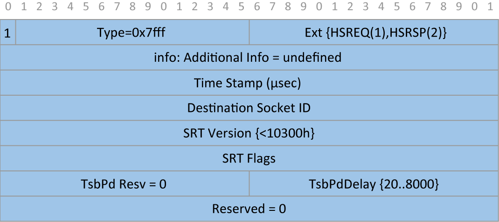

The HSv4 extended handshake is performed with the use of the
aforementioned “SRT Extended Messages”, using control messages with
major type UMSG\_EXT.

Note that these command messages, although sent over an established
connection, are still simply UDP packets. As such they are subject to
all the problematic UDP protocol phenomena, such as packet loss (packet
recovery applies exclusively to the payload packets). Therefore messages
are sent “stubbornly” (with a slight delay between subsequent retries)
until the peer responds, with some maximum number of retries before
giving up. It‘s very important to understand that the first message from
an Initiator is sent at the same moment that the application requests
transmission of the first data packet. This data packet is not held back
until the extended SRT handshake is finished. The first command message
is sent, followed by the first data packet, and the rest of the
transmission continues without having the extended SRT handshake yet
agreed upon.

This means that the initial few data packets might be sent without
having the appropriate SRT settings already working, which may raise two
concerns:

  - > *There is a delay in the application of latency to received
    > packets* — At first, packets are being delivered immediately. It
    > is only when the SRT\_CMD\_HSREQ message is processed that latency
    > is applied to the received packets. The timestamp based packet
    > delivery mechanism (TSBPD) isn‘t working until then.

  - > *There is a delay in the application of encryption (if used) to
    > received packets* — Packets can‘t be decrypted until the
    > SRT\_CMD\_KMREQ is processed and the keys installed. The data
    > packets are still encrypted, but the receiver can‘t decrypt them
    > and will drop them.

The codes for commands used are the same in HSv4 and HSv5 processes. In
HSv4 these are minor message type codes used with the UMSG\_EXT command,
whereas in HSv5 they are in the “command” part of the extension block.
The messages that are sent as “REQ” parts will be repeatedly sent until
they get a corresponding “RSP” part, up to some timeout, after which
they give up and stay with a pure UDT connection.

**HSv5 Extended Handshake Process**

Here is a representation of the HSv5 integrated handshake packet
structure (without SRT header):

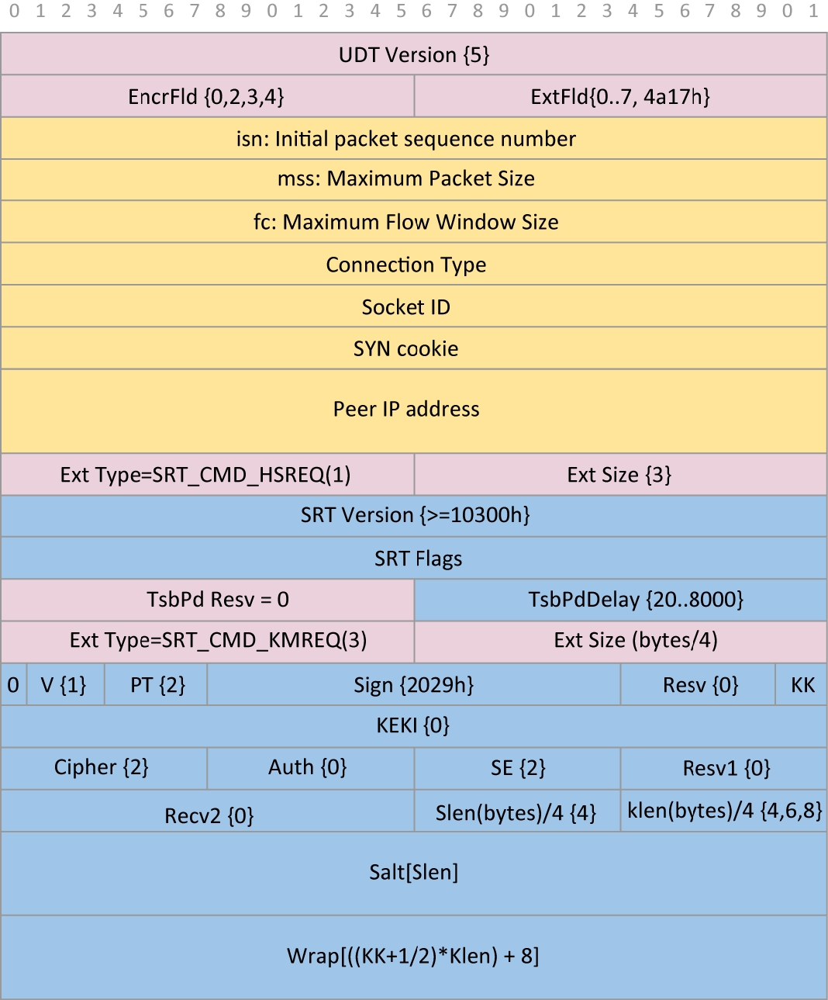

The Extension Flags subfield in the Type field in a conclusion handshake
message contains one of these flags:

  - > HS\_EXT\_HSREQ: defines SRT characteristic data; always present

  - > HS\_EXT\_KMREQ: if using encryption, defines encryption block

  - > HS\_EXT\_CONFIG: information about extra configuration data
    > attached (if any)

The the HSv5 packet structure (shown above) can be split into three
parts:

1.  > The Handshake data (up to the “Peer IP Address” field)

2.  > The HSREQ extension

3.  > The KMREQ extension

Note that extensions are added only in certain situations (as described
above), so sometimes there are no extensions at all. When extensions are
added, the HSREQ extension is always present. The KMREQ extension is
added only if encryption is requested (the passphrase is set by the
SRTO\_PASSPHRASE socket option). There might be also other extensions
placed after HSREQ and KMREQ.

Every extension block has the following structure:

1.  > a 16-bit command symbol

2.  > 16-bit block size (number of 32-bit words following this field)

3.  > a number of 32-bit fields, as specified in (2) above

What is contained in a block depends on the extension command code.

Note that the contents (3) is a number of 32-bit fields, even though
this sometimes contains a free-form string. Except when this is
explicitly mentioned (KMREQ extension, for example), by default all
contents are placed in a form of 32-bit numbers with endian inverted. If
the contents are 32-bit numbers (HSREQ for example), it simply means
that they are in the network order, whereas if the content is a string
(Stream ID, Congestion Control), it’s aligned to 32-bit numbers
(extended with 0 bytes if needed) and placed in the reverse order of the
characters.

The data being received in the extension blocks in the conclusion
message undergo further verification. If the values are not acceptable,
the connection will be rejected. This may happen in the following
situations:

1.  > The Version field contains 0. This means that the peer rejected
    > the handshake.

2.  > The Version field was higher than 4, but no extensions were added
    > (no extension flags set), while the rules state that they should
    > be present. This is considered an error in the case of a
    > URQ\_CONCLUSION message sent by the Initiator to the Responder
    > (there can be an initial conclusion message without extensions
    > sent by the Responder to the Initiator in Rendezvous connections).

3.  > Processing of any of the extension data has failed (also due to an
    > internal error).

4.  > Each side declares a transmission type that is not compatible with
    > the other. This will be described further, along with other new
    > HSv5 features; the HSv4 client supports only and exclusively one
    > transmission type, which is *Live*. This is indicated in the Type
    > field in the HSv4 handshake, which must be equal to UDT\_DGRAM
    > (2), and in the HSv5 by the extra *Congestion Control* block
    > declaration (see below). In any case, when there‘s no Congestion
    > Control type declared, *Live* is assumed. Otherwise the Congestion
    > Control type must be exactly the same on both sides.

**NOTE**: *The TsbPd Resv and TsbPdDelay fields both refer to latency,
but the use is different in HSv4 and HSv5.*

In HSv4, only the lower 16 bits (TsbPdDelay) are used. The upper 16 bits
(TsbPd Resv) are simply unused. There‘s only one direction, so HSREQ is
sent by the Sender, HSRSP by the Receiver. HSREQ contains only the
Sender latency, and HSRSP contains only the Receiver latency.

This is different from HSv5, in which the latency value for the sending
direction in the lower 16 bits (SndTsbPdDelay, 16 - 31 in network order)
and for receiving direction is placed in the upper 16 bits
(RcvTsbpdDelay, 0 - 15). The communication is bidirectional, so there
are two latency values, one per direction. Therefore both HSREQ and
HSREQ messages contain both the Sender and Receiver latency values.

### SRT Extension Commands

**HSREQ and HSRSP**

The SRT\_CMD\_HSREQ message contains three 32-bit fields designated as:

  - > SRT\_HS\_VERSION: string (0x00XXYYZZ) representing SRT version
    > XX.YY.ZZ

  - > SRT\_HS\_FLAGS: the SRT flags (see below)

  - > SRT\_HS\_LATENCY: the latency specification

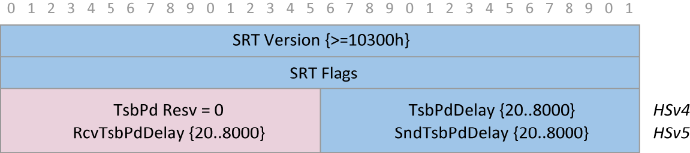

The flags (SRT Flags field) are the following bits, in order:

0.  > SRT\_OPT\_TSBPDSND: The party will be sending in TSBPD (Time Stamp
    > Based Packet Delivery) mode.

> This is used by the Sender party to specify that it will use TSBPD
> mode. The Responder should respond with its setting for TSBPD
> reception; if it isn‘t using TSBPD for reception, it responds with its
> reception TSBPD flag not set. In HSv4, this is only used by the
> Initiator.

1.  > SRT\_OPT\_TSBPDRCV: The party expects to receive in TSBPD mode.

> This is used by a party to specify that it expects to receive in TSBPD
> mode. The Responder should respond to this setting with TSBPD sending
> mode (HSv5 only) and set the sending TSBPD flag appropriately. In HSv4
> this is only used by the Responder party.

2.  > SRT\_OPT\_HAICRYPT: The party includes haicrypt (legacy flag).

> This special legacy compatibility flag should be always set. See below
> for more details.

3.  > SRT\_OPT\_TLPKTDROP: The party will do TLPKTDROP.

> Declares the SRTO\_TLPKTDROP flag of the party. This is important
> because both parties must cooperate in this process. In HSv5, if both
> directions are TSBPD, both use this setting. This flag must always be
> set in live mode.

4.  > SRT\_OPT\_NAKREPORT: The party will do periodic NAK reporting.

> Declares the SRTO\_NAKREPORT flag of the party. This flag means that
> periodic NAK reports will be sent (repeated UMSG\_LOSSREPORT message
> when the sender seems to linger with retransmission).

5.  > SRT\_OPT\_REXMITFLG: The party uses the REXMIT flag.

> This special legacy compatibility flag should be always set. See below
> for more details.

6.  > SRT\_OPT\_STREAM: The party uses stream type transmission.

> This is introduced in HSv5 only. When set, the party is using a stream
> type transmission (file transmission with no boundaries). In HSv4 this
> flag does not exist, and therefore it‘s always clear, which
> corresponds to the fact that HSv4 supports Live mode only.

**Special Legacy Compatibility Flags**

The SRT\_OPT\_HAICRYPT and SRT\_OPT\_REXMITFLG fields define special
cases for the interpretation of the contents in the SRT header for
payload packets.

The SRT header field PH\_MSGNO contains some extra flags that occupy the
most significant bits in this field (the rest are assigned to the
Message Number). Some of these extra flags were already in UDT, but SRT
added some more by re-assigning bits from the Message Number subfield:

1.  > Encryption Key flags (2 bits). Controlled by SRT\_OPT\_HAICRYPT,
    > this field contains a value that declares whether the payload is
    > encrypted and with which key.

2.  > Retransmission flag (1 bit). Controlled by SRT\_OPT\_REXMITFLG,
    > this flag is 0 when a packet is sent the first time, and 1 when it
    > is retransmitted (i.e. requested in a loss report). When the
    > incoming packet is late (one with a sequence number older than the
    > newest received so far), this flag allows the Receiver to
    > distinguish between a retransmitted packet and a reordered packet.
    > This is used by the “reorder tolerance” feature described in the
    > API documentation under SRTO\_LOSSMAXTTL socket option.

As of version 1.2.0 both these fields are in use, and therefore both
these flags must always be set. In theory, there might still exist some
SRT versions older than 1.2.0 where these flags are not used, and these
extra bits remain part of the “Message Number” subfield.

In practice there are no versions around that do not use encryption
bits, although there might be some old SRT versions still in use that do
not include the Retransmission field, which was introduced in version
1.2.0. In practice both these flags must be set in the version that has
them defined. They might be reused in future for something else, once
all versions below 1.2.0 are decommissioned, but the default is for them
to be set.

The SRT\_HS\_LATENCY field defines Sender/Receiver latency.

It is split into two 16-bit parts. The usage differs in HSv4 and HSv5.

In HSv4 only the lower part (bits 16 - 31) is used. The upper part (bits
0 - 15) is always 0. The interpretation of this field is as follows:

  - > Receiver party: Receiver latency

  - > Sender party: Sender latency

In HSv5 both 16-bit parts of the field are used, and interpreted as
follows:

  - > Upper 16 bits (0 - 15): Receiver latency

  - > Lower 16 bits (16 - 31): Sender latency

The characteristics of Sender and Receiver latency are the following:

1.  > Sender latency is the minimum latency that the Sender wants the
    > Receiver to use.

2.  > Receiver latency is the (minimum) value that the Receiver wishes
    > to apply to the stream that it will be receiving.

Once these values are exchanged via the extended handshake, an effective
latency is established, which is always the maximum of the two. Note
that latency is defined in a specified direction. In HSv5, a connection
is bidirectional, and a separate latency is defined for each direction.

The Initiator sends an HSREQ message, which declares the values on its
side. The Responder calculates the maximum values between what it
receives in the HSREQ and its own values, then sends an HSRSP with the
effective latencies.

Here is an example of an HSv5 bidirectional transmission between Alice
and Bob, where Alice is Initiator:

1.  > Alice and Bob set the following latency values:

<!-- end list -->

  - > Alice: SRTO\_PEERLATENCY = 250 ms, SRTO\_RCVLATENCY = 550 ms

  - > Bob: SRTO\_PEERLATENCY = 500 ms, SRTO\_RCVLATENCY = 300 ms

<!-- end list -->

2.  > Alice defines the latency field in the HSREQ message:

<!-- end list -->

  - > hs\[SRT\_HS\_LATENCY\] = { 250, 550 }; // { Lower, Upper }

<!-- end list -->

3.  > Bob receives it, sets his options, and responds with HSRSP:

<!-- end list -->

  - > SRTO\_RCVLATENCY = max(300, 250); //\<-- 250:Alice‘s PEERLATENCY

  - > SRTO\_PEERLATENCY = max(500, 550); //\<-- 550:Alice‘s RCVLATENCY

  - > hs\[SRT\_HS\_LATENCY\] = { 550, 300 };

<!-- end list -->

4.  > Alice receives this HSRSP and sets:

<!-- end list -->

  - > SRTO\_RCVLATENCY = 550;

  - > SRTO\_PEERLATENCY = 300;

<!-- end list -->

5.  > We now have the effective latency values:

<!-- end list -->

  - > For transmissions from Alice to Bob: 300 ms

  - > For transmissions from Bob to Alice: 550 ms

Here is an example of an HSv4 exchange, which is simpler because there‘s
only one direction. We‘ll refer to Alice and Bob again to be consistent
with the Initiator/Responder roles in the HSv5 example:

1.  > Alice sets SRTO\_LATENCY to 250 ms

2.  > Bob sets SRTO\_LATENCY to 300 ms

3.  > Alice sends hs\[SRT\_HS\_LATENCY\] = { 250, 0 }; to Bob

4.  > Bob does SRTO\_LATENCY = max(300, 250);

5.  > Bob sends hs\[SRT\_HS\_LATENCY\] = {300, 0}; to Alice

6.  > Alice sets SRTO\_LATENCY to 300

Note that the SRTO\_LATENCY option in HSv5 sets both SRTO\_RCVLATENCY
and SRTO\_PEERLATENCY to the same value, although when reading,
SRTO\_LATENCY is an alias to SRTO\_RCVLATENCY.

Why is the Sender latency updated to the effective latency for that
direction? Because the TLPKTDROP mechanism, which is used by default in
Live mode, may cause the Sender to decide to stop retransmitting packets
that are known to be too late to retransmit. This latency value is one
of the factors taken into account to calculate the time threshold for
TLPKTDROP.

**KMREQ and KMRSP**

KMREQ and KMRSP contain the KMX (key material exchange) message used for
encryption. The most important part of this message is the AES-wrapped
key (see the Encryption documentation for details). If the encryption
process on the Responder side was successful, the response contains the
same message for confirmation. Otherwise it‘s one single 32-bit value
that contains the value of SRT\_KMSTATE type, as an error status. NOTE:
the AES-wrapped key is stored in the original byte order in the block,
unlike other extensions.

Note that when the encryption settings are different at each end, then
the connection is still allowed, but with the following restrictions:

  - > If the Initiator declares encryption, but the Responder does not,
    > then the Responder responds with SRT\_KM\_S\_NOSECRET status. This
    > means that the Responder will not be able to decrypt data sent by
    > the Initiator, but the Responder can still send unencrypted data
    > to the Initiator.

  - > If the Initiator did not declare encryption, but the Responder
    > did, then the Responder will attach SRT\_CMD\_KMRSP(despite the
    > fact that the Initiator did not send SRT\_CMD\_KMREQ) with
    > SRT\_KM\_S\_UNSECURED status. The Responder won‘t be able to send
    > data to the Initiator (more precisely, it will send scrambled
    > data, not able to be decrypted), but the Initiator will still be
    > able to send unencrypted data to the Responder.

  - > If both have declared encryption, but have set different
    > passwords, the Responder will send a KMRSP block with an
    > SRT\_KM\_S\_BADSECRET value. The transmission in both directions
    > will be “scrambled” (encrypted and not decryptable).

The value of the encryption status can be retrieved from the
SRTO\_SNDKMSTATE and SRTO\_RCVKMSTATE options. The legacy (or
unidirectional) option SRTO\_KMSTATE resolves to SRTO\_RCVKMSTATE by
default, unless the SRTO\_SENDER option is set to true, in which case it
resolves to SRTO\_SNDKMSTATE.

The values retrieved from these options depend on the result of the KMX
process:

1.  > If only one party declares encryption, the KM state will be one of
    > the following:
    
      - > For the party that declares no encryption:
        
          - > RCVKMSTATE: NOSECRET
        
          - > SNDKMSTATE: UNSECURED
        
          - > Result: This party can send payloads unencrypted, but it
            > can‘t decrypt packets received from its peer.
    
      - > For the party that declares encryption:
        
          - > RCVKMSTATE: UNSECURED
        
          - > SNDKMSTATE: NOSECRET
        
          - > Result: This party can receive unencrypted payloads from
            > its peer, and will be able to send encrypted payloads to
            > the peer, but the peer won‘t decrypt them.

2.  > If both declare encryption, but they have different passwords,
    > then both states are SRT\_KM\_S\_BADSECRET. In such a situation
    > both sides may send payloads, but the other party won‘t decrypt
    > them.

3.  > If both declare encryption and the password is the same on both
    > sides, then both states are SRT\_KM\_S\_SECURED. The transmission
    > will be correctly performed with encryption in both directions.

Note that due to the introduction of the bidirectional feature in HSv5
(and therefore the Initiator and Responder roles), the old HSv4 method
of initializing the crypto objects used for security is used only in one
of the directions. This is now called “forward KMX”:

1.  > The Initiator initializes its Sender Crypto (TXC) with
    > preconfigured values. The SEK and SALT values are
    > random-generated.

2.  > The Initiator sends a KMX message to the Receiver.

3.  > The Receiver deploys the KMX message into its Receiver Crypto
    > (RXC)

This is the general process of Security Association done for the
“forward direction”, that is, when done by the Sender. However, as
there‘s only one KMX process in the handshake, in HSv5 this must also
initialize the crypto in the opposite direction. This is accomplished by
“reverse KMX”:

1.  > The Initiator initializes its Sender Crypto (TXC), like above, and
    > then clones it to the Receiver Crypto.

2.  > The Initiator sends a KMX message to the Responder.

3.  > The Responder deploys the KMX message into its Receiver Crypto
    > (RXC)

4.  > The Responder initializes its Sender Crypto by cloning the
    > Receiver Crypto, that is, by extracting the SEK and SALT from the
    > Receiver Crypto and using them to initialize the Sender Crypto
    > (clone the keys).

This way the Sender (being a Responder) has the Sender Crypto
initialized in a manner very similar to that of the Initiator. The only
difference is that the SEK and SALT parameters in the crypto are:

  - > random-generated on the Initiator side

  - > extracted (on the Responder side) from the Receiver Crypto, which
    > was configured by the incoming KMX message

The extra operations defined as “reverse KMX” happen exclusively in the
HSv5 handshake.

The encryption key (SEK) is normally configured to be refreshed after a
predefined number of packets has been sent. To ensure the “soft handoff”
to the new key, this process consists of three activities performed in
order:

1.  > Pre-announcing of the key (SEK is sent by Sender to Receiver)

2.  > Switching the key (at some point packets are encrypted with the
    > new key)

3.  > Decommissioning the key (removing the old, unused key)

Pre-announcing is done using an SRT Extended Message with the
SRT\_CMD\_KMREQ extended type, where only the “forward KMX” part is
done. When the transmission is bidirectional, the key refreshing process
happens completely independently for each direction, and it‘s always
initiated by the sending side, independently of Initiator and Responder
roles (actually, these roles are significant only up to the moment when
the connection is considered established).

The decision as to when exactly to perform particular activities
belonging to the key refreshing process is made when the number of sent
packets exceeds a certain value (up to the moment of the connection or
previous refresh), which is controlled by the SRTO\_KMREFRESHRATE and
SRTO\_KMPREANNOUNCE options:

1.  > Pre-announce: when \## of sent packets \> SRTO\_KMREFRESHRATE -
    > SRTO\_KMPREANNOUNCE

2.  > Key switch: when \## of sent packets \> SRTO\_KMREFRESHRATE

3.  > Decommission: when \## of sent packets \> SRTO\_KMREFRESHRATE +
    > SRTO\_KMPREANNOUNCE

In other words, SRTO\_KMREFRESHRATE is the exact number of transmitted
packets for which a key switch happens. The Pre-announce happens
SRTO\_KMPREANNOUNCE packets earlier, and Decommission happens
SRTO\_KMPREANNOUNCE packets later. The SRTO\_KMPREANNOUNCE value serves
as an intermediate delay to make sure that from the moment of switching
the keys the new key is deployed on the Receiver, and that the old key
is not decommissioned until the last packet encrypted with that key is
received.

The following activities occur when keys are refreshed:

1.  > Pre-announce: The new key is generated and sent to the Receiver
    > using the SRT Extended Message SRT\_CMD\_KMREQ. The received key
    > is deployed into the Receiver Crypto. The Receiver sends back the
    > same message through SRT\_CMD\_KMRSP as a confirmation that the
    > refresh was successful (if it wasn‘t, the message contains an
    > error code).

2.  > Key Switch: The Encryption Flags in the PH\_MSGNO field get
    > toggled between EK\_EVEN and EK\_ODD. From this moment on, the
    > opposite (newly generated) key is used.

3.  > Decommission: The old key (the key that was used with the previous
    > flag state) is decommissioned on both the Sender and Receiver
    > sides. The place for the key remains open for future key
    > refreshing.

**NOTE**: *The handlers for KMREQ and KMRSP are the same for handling
the request coming through an SRT Extended Message and through the
handshake extension blocks, except that in case of the SRT Extended
Message only one direction (forward KMX) is updated. HSv4 relies only on
these messages, so there‘s no difference between initial and refreshed
KM exchange. In HSv5 the initial KM exchange is done within the
handshake in both directions, and then the key refresh process is
started by the Sender and it updates the key for one direction only.*

### SRT Congestion Control

The SRT Congestion Control feature (supported by HSv5 only) adds
functionality similar to the “congestion control” class from UDT.

Its value is a string with the name of the SRT Congestion Control type.
The default is “live”. SRT version 1.3.0 contains an additional optional
Congestion Control type called “file”, within which it is possible to
designate a stream mode and a message mode (the “live” Congestion
Control may only use the message mode, with one message per packet).

The SRT Congestion Control feature is not obligatory when not present.
The “live” Congestion Control type is used by default.

For an HSv4 party (which doesn‘t support this feature) the Congestion
Control type is assumed to be “live”. The “file” Congestion Control type
reintroduces the old UDT features for stream transmission (together with
the SRT\_OPT\_STREAM flag) and messages that can span multiple UDP
packets. The Congestion Control types differ in the way the transmission
is handled, how various transmission settings are applied, and how they
handle any special phenomena that happen during transmission.

The “file” Congestion Control type is based on the original CUDTCC class
from UDT, and the rules for congestion control are copied from there.
However, it contains many changes and allows the selection of the
original UDT code in places that have been modified in SRT to support
live transmission.

### Stream ID (SID)

This feature is supported by HSv5 only. Its value is a string of the
user‘s choice that can be passed from the Caller to the Listener.

The Stream ID is a string of up to 512 characters that an Initiator can
pass to a Responder. To use this feature, an application should set it
on a Caller socket using the SRTO\_STREAMID option. Upon connection, the
accepted socket on the Listener side will have exactly the same value
set, and it can be retrieved using the same option. This gives the
Listener a chance to decide what to do with this connection — such as to
decide which stream to send in the case where the Listener is the stream
Sender. This feature is not intended to be used for Rendezvous
connections.

## Sample Implementation — HSv4 (Legacy) Caller/Listener Handshake with SRT Extensions

*Part 1 of 4: Begin HSv4 UDT Caller/Listener Handshake*

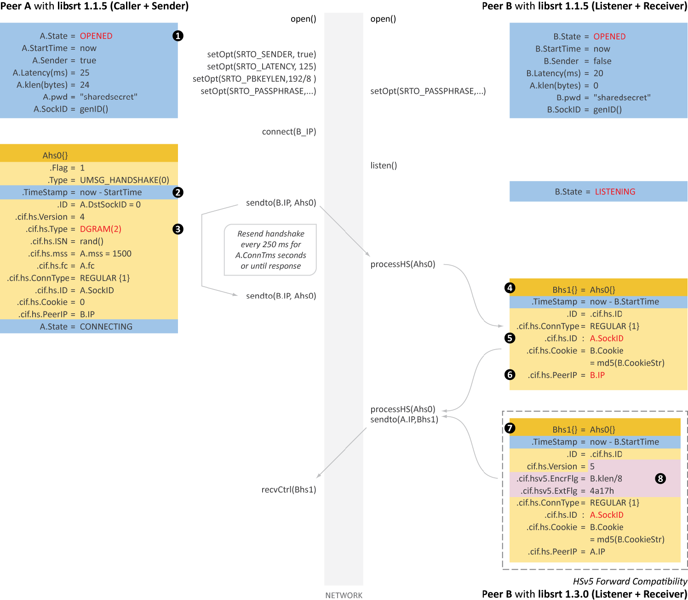

<table>
<tbody>
<tr class="odd">
<td>
<strong>1</strong>. HSv4 UDT4 Handshake packet; Ahs0 = Handshake step 0 from party A

<strong>2</strong>. TimeStamp was not set in UDT4 for control packets

<strong>3</strong>. DGRAM {2} is interpreted as unknown in UDT wireshark plugin based on draft.

<ul>
<li><blockquote>

draft: STREAM{0},DGRAM{1}

</blockquote></li>
<li><blockquote>

code: STREAM{1},DGRAM{2}

</blockquote></li>
</ul>

Code values are in sync with Linux socket values SOCK_STREAM and SOCK_DGRAM.
</td>
<td>
<strong>4</strong>. HSv4 UDT4 Handshake packet

<strong>5</strong>. in UDT4 code: copy from Ahs0 kept so A.SockID is present here. Draft is vague about this so implementation is de-facto std.

<strong>6</strong>. in UDT4 code: copy from Ahs0 kept so B.IP is present here. 
Draft is vague about this so implementation is de-facto std

<strong>7</strong>. HSv5 Handshake Packet

<strong>8</strong>. These HSv5 fields are ignored by HSv4 calling peers.
</td>
</tr>
</tbody>
</table>

Sample Implementation — **HSv4 (Legacy) Caller/Listener Handshake with
SRT Extensions** (cont’d)

*Part 2 of 4: Begin HSv4 UDT Caller/Listener Conclusion Phase*

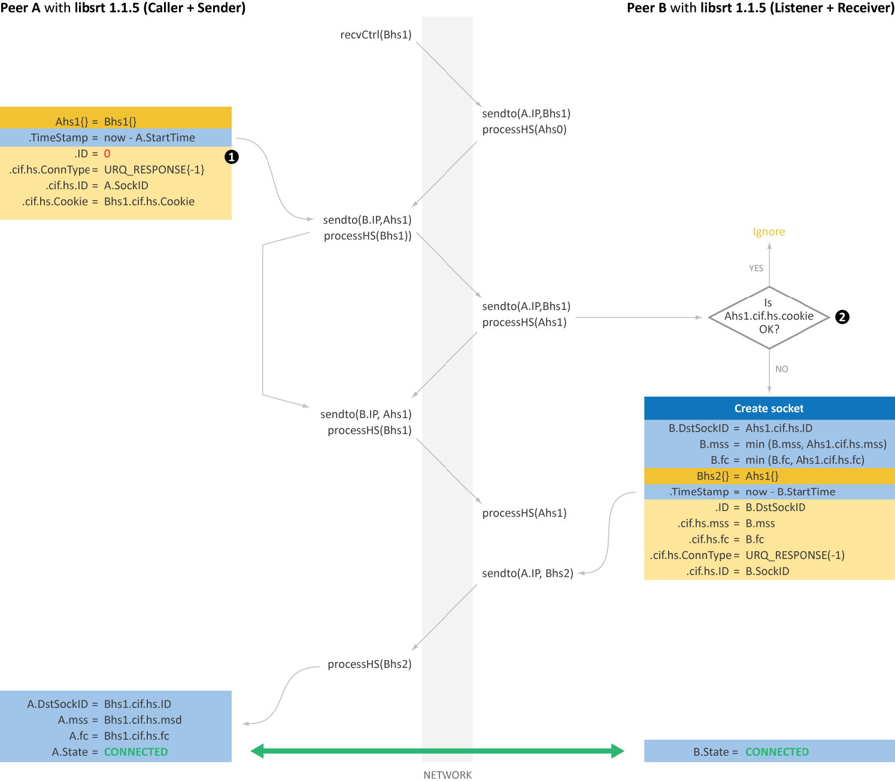

|                                                                                                                                                             |                                                                                                                |
| ----------------------------------------------------------------------------------------------------------------------------------------------------------- | -------------------------------------------------------------------------------------------------------------- |
| **1**. We must continue to use 0 for destination ID here since the Listener did not provided its Socket ID yet: cif.hs.ID contains our own SockID from Ahs0 | **2**. Cookie is generated by Listener (B) but transmitted to A and we verify here that A sent it back in Ahs1 |

##   

Sample Implementation — **HSv4 (Legacy) Caller/Listener Handshake with
SRT Extensions** (cont’d)

*Part 3 of 4: Begin HSv4 UDT Caller/Listener Conclusion Phase*

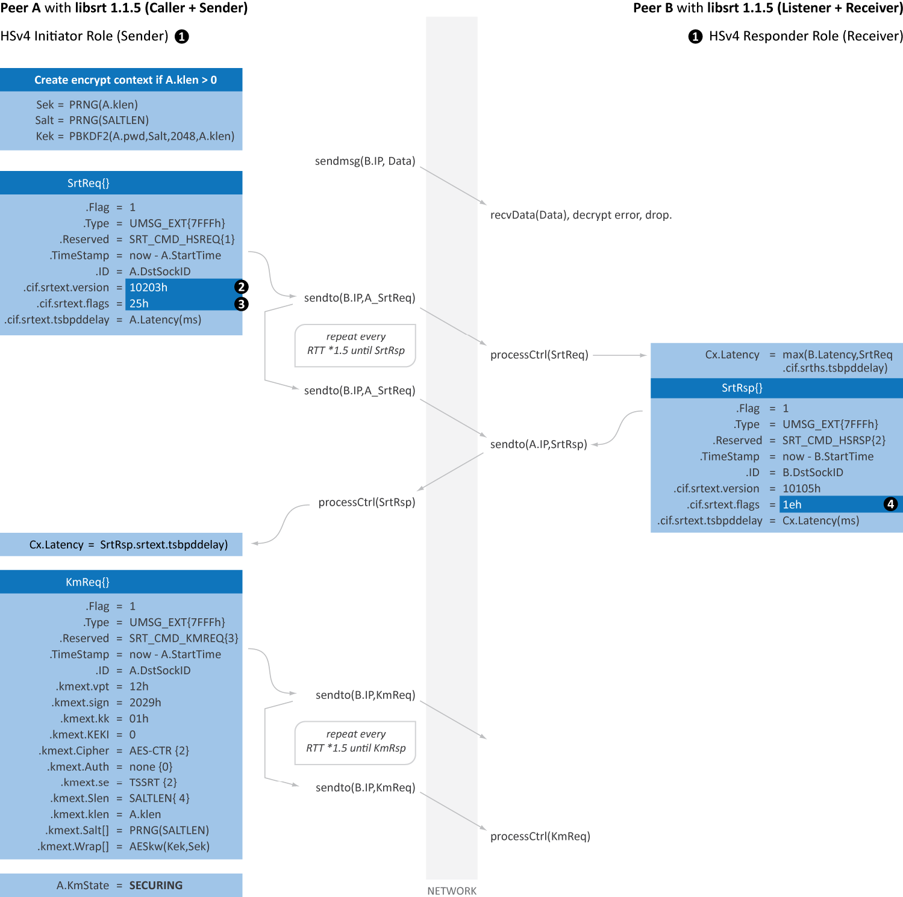

<table>
<tbody>
<tr class="odd">
<td>
<strong>1</strong>. From this point UDT4 handshake is completed, sockets are connected, and the peer that is the Sender (could be any of Caller, Listener, or Rendezvous) initiates the SRT Handshake.

<strong>2</strong>. Version 1.2.3
</td>
<td>
<strong>3</strong>. 01h: TsbPD sender 08h: TLPktDrop

02h: TsbPD receiver 10h: NAK Report

04h: HaiCrypt supported 20h: ReXmit Flag

<strong>4</strong>. 01h: TsbPD sender 08h: TLPktDrop

02h: TsbPD receiver 10h: NAK Report

04h: HaiCrypt supported 20h: ReXmit Flag
</td>
</tr>
</tbody>
</table>

Sample Implementation — **HSv4 (Legacy) Caller/Listener Handshake with
SRT Extensions** (cont’d)

*Part 4 of 4: HSv4 UDT Caller/Listener Conclusion Phase*

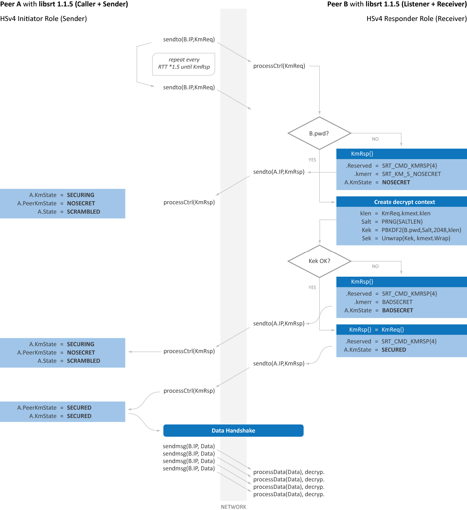

## Terminology

| **Term** | **Description**                                                |
| -------- | -------------------------------------------------------------- |
| AEAD     | Authenticated Encryption with Associated Data                  |
| AES      | Advanced Encryption Standard                                   |
| AESkw    | AES key wrap not specified (\[RFC3394\] or \[ANSX9.102\])      |
| AESKW    | AES Key Wrap with associated data authentication \[ANSX9.102\] |
| ARM      | Advanced RISC Machine (Texas Instrument processor)             |
| CCM      | Counter with CBC-MAC                                           |
| CTR      | Counter                                                        |
| DSP      | Digital Signal Processor                                       |
| DVB      | Digital Video Broadcast                                        |
| DVB-CA   | DVB - Conditional Access                                       |
| ECB      | Electronic Code Book                                           |
| ECM      | Entitlement Control Message (DVB/MPEG)                         |
| EKT      | Encrypted Key Transport (SRTP)                                 |
| eSEK     | Even SEK                                                       |
| FIPS     | Federal Information Processing Standard                        |
| GCM      | Galois/Counter mode                                            |
| GDOI     | Group Domain Of Interpretation                                 |
| GOP      | Group Of Pictures                                              |
| HDCP     | High-bandwidth Digital Content Protection                      |
| HMAC     | Hash-based Message Authentication Code                         |
| HTTP     | Hypertext Transfer Protocol                                    |
| HTTPS    | HTTP Secure                                                    |
| IV       | Initialisation Vector                                          |
| KEK      | Key Encrypting Key                                             |
| LSB      | Least Significant Bits                                         |
| MAC      | Message Authentication Code                                    |
| MD5      | Message Digest 5                                               |
| MIKEY    | Multimedia Internet KEYing                                     |
| MPEG     | Motion Picture Expert Group                                    |
| MSB      | Most Significant Bits                                          |
| oSEK     | Odd SEK                                                        |
| PBKDF2   | Password-Based Key Derivation Function version 2               |
| PES      | Packetized Elementary Stream (MPEG)                            |
| PKCS     | Public-Key Cryptography Standards                              |
| PRNG     | Pseudo Random Number Generator                                 |
| RISC     | Reduced Instruction Set Computer                               |
| RTP      | Read-time Transport Protocol                                   |
| SEK      | Stream Encrypting Key                                          |
| SHA      | Secure Hash Algorithm                                          |
| SIV      | Synthetic Initialisation Vector                                |
| SO       | Security Officer                                               |
| SRT      | Secure Reliable Transport                                      |
| SRTP     | Secure Real-time Transport Protocol                            |
| SSL      | Secure Socket Layer                                            |
| TP       | Transmission Payload                                           |
| TS       | Transport Stream (MPEG)                                        |
| TU       | Transmission Unit                                              |
| UDP      | User Datagram Protocol                                         |

## References

### SRT Alliance

  - > SRT Deployment Guide

### SRT on GitHub

  - > API.md

  - > build\_iOS.md

  - > encryption.md

  - > live-streaming.md

  - > reporting.md

  - > stransmit.md

  - > why-srt-was-created.md

  - > [handshake.md](https://github.com/ethouris/srt/blob/97386cc7646d1152bf0257f3e6da4545d48aa5a1/docs/handshake.md)

### UDT

  - > [http://udt.sourceforge.net/doc.html](http://udt.sourceforge.net/doc.html)

> **Protocol Specification**

  - > UDT Internet Draft (04/12/2010):
    > [draft-gg-udt-03.txt](http://udt.sourceforge.net/doc/draft-gg-udt-03.txt)

> **User Manual**

  - > UDT version 4

  - > UDT version 3

> **Technical Papers**

  - > UDTv4: Improvements in Performance and Usability

Yunhong Gu and Robert L. Grossman

GridNets 2008, Beijing, China, October 8-10, 2008.

[Paper (PDF) \[244
KB\]](http://udt.sourceforge.net/doc/udt-ccc-sc05-v10.pdf)
Presentation (PPT) \[171 KB\]

  - > UDT: UDP-based Data Transfer for High-Speed Wide Area Networks

Yunhong Gu and Robert L. Grossman

Computer Networks (Elsevier). Volume 51, Issue 7. May 2007.

  - > Supporting Configurable Congestion Control in Data Transport
    > Services

Yunhong Gu and Robert L. Grossman

SC 2005, Nov 12 - 18, Seattle, WA, USA

[Paper (PDF) \[260
KB\]](http://udt.sourceforge.net/doc/udt-ccc-sc05-v10.pdf)
Presentation (PPT) \[171 KB\]

  - > Optimizing UDP-based Protocol Implementation

Yunhong Gu and Robert L. Grossman

PFLDNet 2005, Lyon, France, Feb. 2005

[Paper (PDF) \[259
KB\]](http://udt.sourceforge.net/doc/pfldnet2005-v8.pdf)
Presentation (PPT) \[272 KB\]

  - > Experiences in Design and Implementation of a High Performance
    > Transport Protocol

Yunhong Gu, Xinwei Hong, and Robert L. Grossman

SC 2004, Nov 6 - 12, Pittsburgh, PA, USA.

[Paper (PDF) \[349
KB\]](http://udt.sourceforge.net/doc/udt-design-sc04-v8.pdf)
Presentation (PPT) \[490 KB\]

  - > An Analysis of AIMD Algorithms with Decreasing Increases

Yunhong Gu, Xinwei Hong and Robert L. Grossman

First Workshop on Networks for Grid Applications (Gridnets 2004), Oct.
29, San Jose, CA, USA.

[Paper (PDF) \[332
KB\]](http://udt.sourceforge.net/doc/gridnet-v8.pdf)
Presentation (PPT) \[313 KB\]

  - > SABUL: A Transport Protocol for Grid Computing

Yunhong Gu and Robert L. Grossman

Journal of Grid Computing, 2003, Volume 1, Issue 4, pp. 377-386

Paper (PDF) \[271 KB\]

> **Presentations**

  - > [UDT: Breaking the Data Transfer
    > Bottleneck](http://udt.sourceforge.net/doc/udt.ppt), Oct.
    > 2005. ([Updated
    > version](http://udt.sourceforge.net/doc/udt-2009.ppt), Aug.
    > 2009)

  - > [An Introduction to
    > UDT](http://udt.sourceforge.net/doc/I2Spring-UDT.ppt):
    > Spring 2005 Internet2 Member Meeting, Arlington, VA, May 2 - 5,
    > 2005.

  - > [UDT: UDP-based Data
    > Transfer](http://udt.sourceforge.net/doc/pfldnet04-udt-uic-anl.ppt):
    > PFLDNet 2004, Chicago, IL, Feb. 17 - 18, 2004.

  - > An Introduction to SABUL/UDT: ESCC/Internet2 Techs Workshop,
    > Lawrence, KS, August 4 - 7, 2003.

  - > [A UDT
    > Tutorial](http://udt.sourceforge.net/doc/udt-tutorial.ppt)
    > (SC 2004, outdated)

### Encryption

  - > \[ANSX9.102\] Accredited Standards Committee, Wrapping of Keys and
    > Associated Data, ANS X9.102, not for free document.

  - > \[FIPS 140-2\] Security Requirements for Cryptographic Modules,
    > NIST, [FIPS PUB
    > 140-2](https://csrc.nist.gov/csrc/media/publications/fips/140/2/final/documents/fips1402.pdf),
    > May 2001.

  - > \[FIPS 140-3\] Security Requirements for Cryptographic Modules,
    > NIST, [FIPS PUB
    > 140-3](https://csrc.nist.gov/publications/detail/fips/140/3/archive/2009-12-11),
    > December 2009.

  - > \[SP800-38A\] Recommendation for Block Cipher Modes of Operation,
    > M. Dworkin, NIST,
    > [FP800-38A](https://csrc.nist.gov/publications/detail/sp/800-38a/final),
    > December 2001.

  - > \[HDCP2\] High-bandwidth Digital Content Protection System,
    > Interface Independent Adaptation, Revision 2.0,
    > [HDCP IIA
    > 2.0](https://www.digital-cp.com/files/static_page_files/2C1C0F30-0E09-E813-BFAB6BAAE8A76080/HDCP%20Interface%20Independent%20Adaptation%20Specification%20Rev2_0.pdf),
    > Digital Content Protection, LLC, October 2008.

  - > \[PKCS5\] [PKCS \#5 v2.0 Password-Based
    > Cryptography
    > Standard](http://www.rsa.com/rsalabs/node.asp?id=2127), RSA
    > Laboratories, March 1999.

  - > \[RFC2998\] PKCS \#5: Password-Based Cryptography Specification
    > Version 2.0, B. Kaliski,
    > [RFC2898](https://tools.ietf.org/html/rfc2898),
    > September 2000.

  - > \[RFC3394\] Advanced Encryption Standard (AES) Key Wrap Algorithm,
    > J. Schaad, R. Housley,
    > [RFC3394](https://tools.ietf.org/html/rfc3394),
    > September 2002.

  - > \[RFC3547\] The Group Domain of Interpretation, M. Baugher, B.
    > Weis, T. Hardjono, H. Harney,
    > [RFC3547](https://tools.ietf.org/html/rfc3547),
    > July 2003.

  - > \[RFC3610\] Counter with CBC-MAC (CCM), D. Whiting, R. Housley, N.
    > Ferguson,
    > [RFC3610](https://tools.ietf.org/html/rfc3610),
    > September 2003.

  - > \[RFC3711\] The Secure Real-time Transport Protocol (SRTP), M.
    > Baugher, D. McGrew, M. Naslund, E. Carrara, K. Norrman,
    > [RFC3711](https://tools.ietf.org/html/rfc3711),
    > March 2004.

  - > \[RFC3830\] MIKEY: Multimedia Internet KEYing, J, Arkko, E.
    > Carrara, F. Lindholm, M. Naslund, K. Norrman,
    > [RFC3830](https://tools.ietf.org/html/rfc3830),
    > August 2004.

  - > \[RFC5297\] Synthetic Initialization Vector (SIV) Authenticated
    > Encryption Using the Advanced Encryption Standard (AES), D.
    > Harkins,
    > [RFC5297](https://tools.ietf.org/html/rfc5297),
    > October 2008.

  - > \[RFC5649\] Advanced Encryption Standard (AES) Key Wrap with
    > Padding Algorithm, R. Housley, M. Dworkin,
    > [RFC5649](https://tools.ietf.org/html/rfc5649),
    > August 2009.

  - > \[RFC6070\] PBKDF2 Test Vectors

  - > \[SRTP-EKT\] Encrypted Key Transport for Secure RTP, D. McGrew, F.
    > Andreasen, D. Wing, K. Fisher,
    > [draft-ietf-avt-srtp-ekt-02](https://tools.ietf.org/html/draft-ietf-avt-srtp-ekt-02),
    > March 2011.

1.  https://datatracker.ietf.org/doc/draft-gg-udt/history/

2.  It was later discovered that this model is not a good simulation as
    packets are dropped without any network congestion. Packet loss was
    simulated in both directions, which means some feedback control
    packets were also dropped.

3.  This is the multiplexer: multiple SRT sockets sharing the same UDP
    socket.

4.  The most common Ethernet MTU is 1500. Assigning 4 bytes for VLANs
    leaves 1496. One MPEG cell = 188, and 7 TS cells is the maximum that
    fits within 1500 allowing for protocol headers (1316 + headers =
    1360). Note that the UDP output packet size (MTU) for an SRT sender
    can be set via the API using SRTO\_MSS: max segment size, which
    includes 28+16 bits for the IP/UDP/SRT header.

5.  Attempts were made to try to detect and hold back the NAK a little
    bit to see if the packet would arrive afterwards. If packet 3
    arrived just after packet 4, the NAK would be canceled. But this
    would cause the receiver to hold back certain packets but continue
    to send the others, putting the packets out of order. Choosing a
    specific packet and then changing the order in which it is expected
    to arrive introduces a type of jitter.

6.  Timestamps also help measure recovery buffers in time duration
    instead of bytes or packets. Time-based stats are more easily
    understandable by operators and independent of content bit rate.

7.  ACKinterval (pkts) and ACKperiod (ms) used to be configurable.

8.  A light ACK is a shorter ACK (header + 1 x 32-bit field). It does
    not trigger an ACKACK.

9.  The period is based on a number of packets rather than time duration
    to ensure enough samples, independently of the media stream packet
    rate. The effect of network jitter on the estimated time drift is
    attenuated by using a large number of samples. The time drift being
    very slow (affecting a stream only after many hours), a fast
    reaction is not necessary.

10. If you set SRTO\_MAXBW=0 and SRTO\_INPUTBW=0 then the input bitrate
    will be measured internally and used to adjust the output bitrate to
    measured-input\*(100+overhead)/100, overhead being configured with
    SRTO\_OHEABW (in %). Note that the units of SRTO\_MAXBW and
    SRTO\_INPUTBW are in bytes/sec.

11. If neither SRTO\_MAXBW nor SRTO\_INPUTBW is set, the default output
    ceiling is 30 mbps.

12. Unfortunately this packet probe pair approach is better suited for
    calculating the available bandwidth of a link where the capacity is
    known (which is usually not the case). It is actually measuring the
    cross traffic inserted between UDT packets, where \[capacity\] –
    \[cross traffic\] = \[available bandwidth\].

13. Digital Video Broadcasting (DVB) encryption
    (https://www.dvb.org/resources/public/standards/a125\_dvb-csa3.pdf)

14. In future versions of SRT, it might be possible to implement a key
    wrapper with integrity such as AESKW \[ANSX9.102\] or AES-SIV
    \[RFC5297\].
